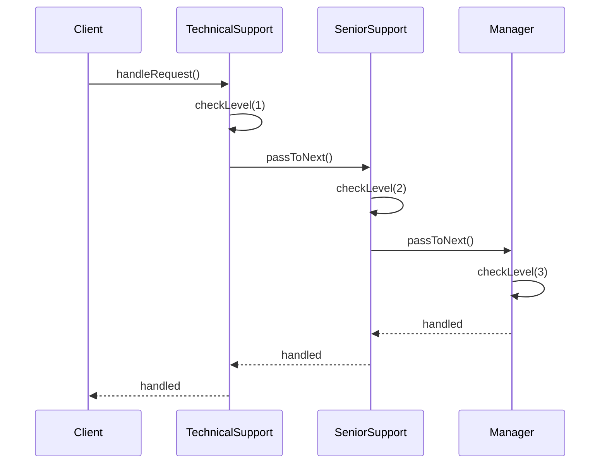
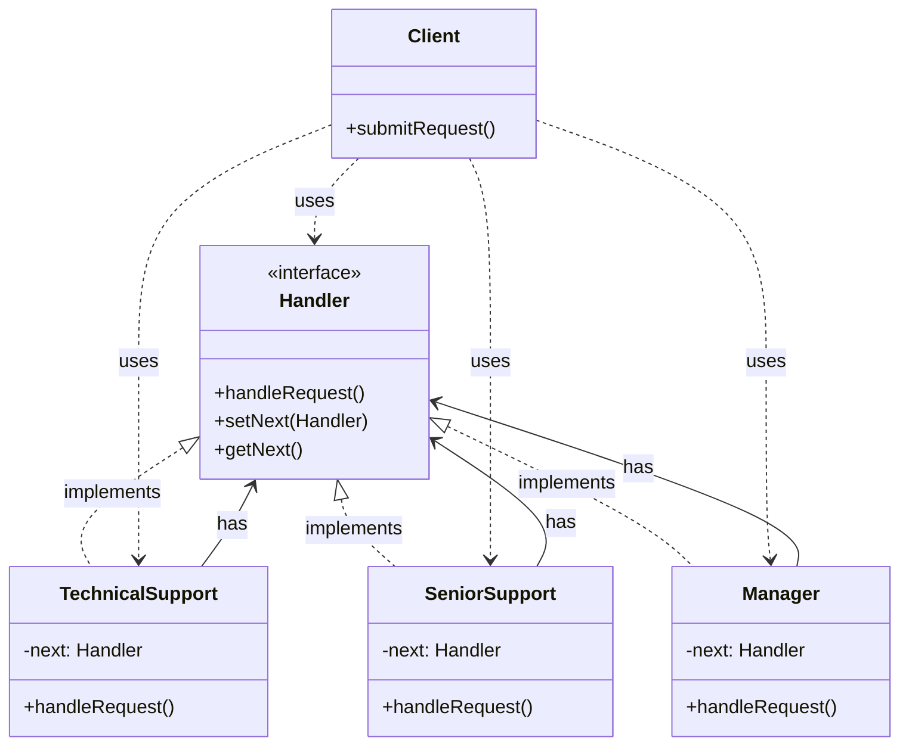

Tôi sẽ giải thích Chain of Responsibility Pattern với ví dụ về hệ thống xử lý yêu cầu hỗ trợ khách hàng, một ví dụ thực tế và dễ hiểu:

###  1. Sequence Diagram - Luồng hoạt động



In the diagram above:

- Solid arrows (->>) represent method calls
- Dashed arrows (-->>) represent return values
- The interaction flow is read from top to bottom
- Shows how requests are passed through the chain of handlers

###  2. Class Diagram - Cấu trúc chi tiết



In the diagram above:

- Solid arrows with triangles (--|>) represent inheritance (implements)
- Dashed arrows (..>) represent usage relationships (uses)
- Each handler has a reference to the next handler in the chain
- Components marked with <<interface>> are interfaces
- Other components are classes

Example code to illustrate:

```java
// Interface for handlers
interface Handler {
    void handleRequest(Request request);
    void setNext(Handler handler);
    Handler getNext();
}

// Abstract handler class
abstract class AbstractHandler implements Handler {
    protected Handler next;

    @Override
    public void setNext(Handler handler) {
        this.next = handler;
    }

    @Override
    public Handler getNext() {
        return next;
    }

    protected void passToNext(Request request) {
        if (next != null) {
            next.handleRequest(request);
        }
    }
}

// Concrete handler classes
class TechnicalSupport extends AbstractHandler {
    @Override
    public void handleRequest(Request request) {
        if (request.getLevel() <= 1) {
            System.out.println("TechnicalSupport: Handling request level " + request.getLevel());
        } else {
            passToNext(request);
        }
    }
}

class SeniorSupport extends AbstractHandler {
    @Override
    public void handleRequest(Request request) {
        if (request.getLevel() <= 2) {
            System.out.println("SeniorSupport: Handling request level " + request.getLevel());
        } else {
            passToNext(request);
        }
    }
}

class Manager extends AbstractHandler {
    @Override
    public void handleRequest(Request request) {
        System.out.println("Manager: Handling request level " + request.getLevel());
    }
}

// Request class
class Request {
    private int level;

    public Request(int level) {
        this.level = level;
    }

    public int getLevel() {
        return level;
    }
}

// Client class
class Client {
    private Handler handler;

    public Client() {
        // Create chain of responsibility
        Handler technical = new TechnicalSupport();
        Handler senior = new SeniorSupport();
        Handler manager = new Manager();

        technical.setNext(senior);
        senior.setNext(manager);
        handler = technical;
    }

    public void submitRequest(Request request) {
        handler.handleRequest(request);
    }
}

// Usage example
public class Main {
    public static void main(String[] args) {
        Client client = new Client();

        // Submit requests with different levels
        client.submitRequest(new Request(1)); // Handled by TechnicalSupport
        client.submitRequest(new Request(2)); // Handled by SeniorSupport
        client.submitRequest(new Request(3)); // Handled by Manager
    }
}
```

Chain of Responsibility Pattern allows passing a request along a chain of potential handlers until one of them handles it. Each handler decides whether to process the request or pass it to the next handler in the chain.