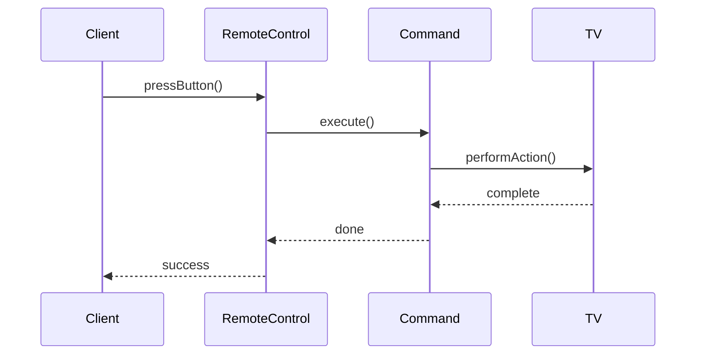
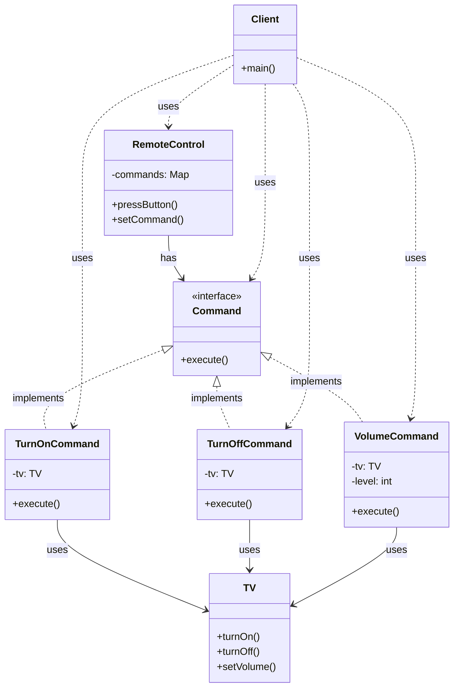

I'll explain the Command Pattern with a remote control example, a practical and easy-to-understand scenario:

###  1. Sequence Diagram - Operation Flow



In the diagram above:

- Solid arrows (->>) represent method calls
- Dashed arrows (-->>) represent return values
- The interaction flow is read from top to bottom
- Shows how commands are executed through the invoker

###  2. Class Diagram - Detailed Structure



In the diagram above:

- Solid arrows with triangles (--|>) represent inheritance (implements)
- Dashed arrows (..>) represent usage relationships (uses)
- Components marked with <<interface>> are interfaces
- Other components are classes

Example code to illustrate:

```java
// Command interface
interface Command {
    void execute();
}

// Receiver class (TV)
class TV {
    public void turnOn() {
        System.out.println("TV: Turning on");
    }
    
    public void turnOff() {
        System.out.println("TV: Turning off");
    }
    
    public void setVolume(int level) {
        System.out.println("TV: Setting volume to " + level);
    }
}

// Concrete command classes
class TurnOnCommand implements Command {
    private TV tv;
    
    public TurnOnCommand(TV tv) {
        this.tv = tv;
    }
    
    @Override
    public void execute() {
        tv.turnOn();
    }
}

class TurnOffCommand implements Command {
    private TV tv;
    
    public TurnOffCommand(TV tv) {
        this.tv = tv;
    }
    
    @Override
    public void execute() {
        tv.turnOff();
    }
}

class VolumeCommand implements Command {
    private TV tv;
    private int level;
    
    public VolumeCommand(TV tv, int level) {
        this.tv = tv;
        this.level = level;
    }
    
    @Override
    public void execute() {
        tv.setVolume(level);
    }
}

// Invoker class (RemoteControl)
class RemoteControl {
    private Map<String, Command> commands = new HashMap<>();
    
    public void setCommand(String button, Command command) {
        commands.put(button, command);
    }
    
    public void pressButton(String button) {
        Command command = commands.get(button);
        if (command != null) {
            command.execute();
        }
    }
}

// Client class
class Client {
    public static void main(String[] args) {
        // Create receiver
        TV tv = new TV();
        
        // Create commands
        Command turnOn = new TurnOnCommand(tv);
        Command turnOff = new TurnOffCommand(tv);
        Command setVolume = new VolumeCommand(tv, 5);
        
        // Create invoker
        RemoteControl remote = new RemoteControl();
        
        // Set up commands
        remote.setCommand("ON", turnOn);
        remote.setCommand("OFF", turnOff);
        remote.setCommand("VOL", setVolume);
        
        // Use remote control
        remote.pressButton("ON");
        remote.pressButton("VOL");
        remote.pressButton("OFF");
    }
}
```

Command Pattern encapsulates a request as an object, allowing you to parameterize clients with different requests, queue or log requests, and support undoable operations. It provides a flexible way to handle requests without having a direct coupling between the sender and receiver.