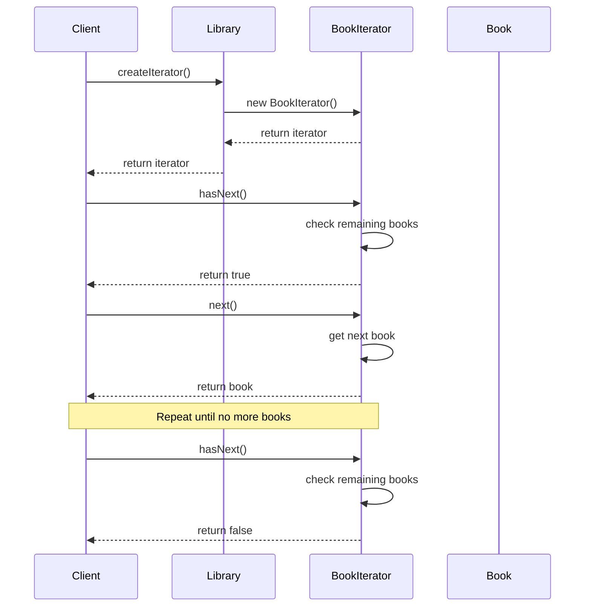
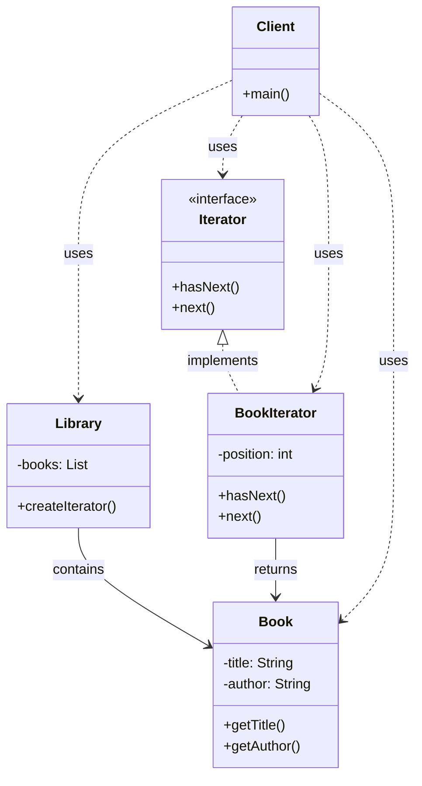

I'll explain the Iterator Pattern with a library book management system example, a practical and easy-to-understand scenario:

###  1. Sequence Diagram - Operation Flow



In the diagram above:

- Solid arrows (->>) represent method calls
- Dashed arrows (-->>) represent return values
- The interaction flow is read from top to bottom
- Shows the iteration process through the collection

###  2. Class Diagram - Detailed Structure



In the diagram above:

- Solid arrows with triangles (--|>) represent inheritance (implements)
- Dashed arrows (..>) represent usage relationships (uses)
- Components marked with <<interface>> are interfaces
- Other components are classes

Example code to illustrate:

```java
// Iterator interface
interface Iterator {
    boolean hasNext();
    Object next();
}

// Book class
class Book {
    private String title;
    private String author;
    
    public Book(String title, String author) {
        this.title = title;
        this.author = author;
    }
    
    public String getTitle() {
        return title;
    }
    
    public String getAuthor() {
        return author;
    }
}

// Library class (Aggregate)
class Library {
    private List<Book> books = new ArrayList<>();
    
    public void addBook(Book book) {
        books.add(book);
    }
    
    public Iterator createIterator() {
        return new BookIterator(books);
    }
}

// BookIterator class
class BookIterator implements Iterator {
    private List<Book> books;
    private int position = 0;
    
    public BookIterator(List<Book> books) {
        this.books = books;
    }
    
    @Override
    public boolean hasNext() {
        return position < books.size();
    }
    
    @Override
    public Object next() {
        return books.get(position++);
    }
}

// Client class
class Client {
    public static void main(String[] args) {
        // Create library
        Library library = new Library();
        
        // Add books
        library.addBook(new Book("Design Patterns", "Gamma et al"));
        library.addBook(new Book("Clean Code", "Robert Martin"));
        
        // Create iterator
        Iterator iterator = library.createIterator();
        
        // Iterate through books
        while (iterator.hasNext()) {
            Book book = (Book) iterator.next();
            System.out.println("Title: " + book.getTitle() +
                             ", Author: " + book.getAuthor());
        }
    }
}
```

Iterator Pattern provides a way to access the elements of an aggregate object sequentially without exposing its underlying representation. It allows you to traverse a collection without having to know the details of how the collection is implemented.