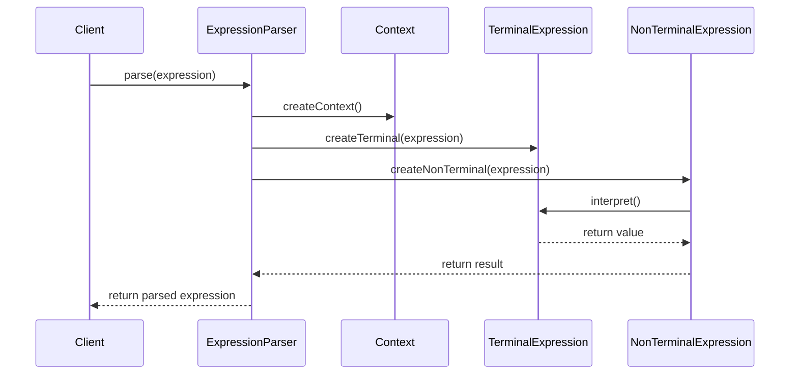
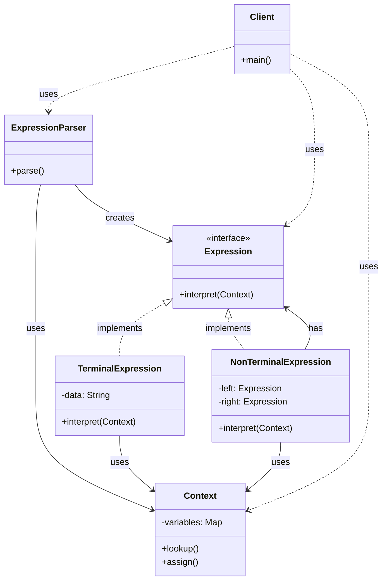

I'll explain the Interpreter Pattern with a calculator expression example, a practical and easy-to-understand scenario:

###  1. Sequence Diagram - Operation Flow



In the diagram above:

- Solid arrows (->>) represent method calls
- Dashed arrows (-->>) represent return values
- The interaction flow is read from top to bottom
- Shows how expressions are parsed and interpreted

###  2. Class Diagram - Detailed Structure



In the diagram above:

- Solid arrows with triangles (--|>) represent inheritance (implements)
- Dashed arrows (..>) represent usage relationships (uses/creates)
- Components marked with <<interface>> are interfaces
- Other components are classes

Example code to illustrate:

```java
// Expression interface
interface Expression {
    int interpret(Context context);
}

// Terminal expression class
class TerminalExpression implements Expression {
    private String data;
    
    public TerminalExpression(String data) {
        this.data = data;
    }
    
    @Override
    public int interpret(Context context) {
        return Integer.parseInt(data);
    }
}

// Non-terminal expression class
class NonTerminalExpression implements Expression {
    private Expression left;
    private Expression right;
    
    public NonTerminalExpression(Expression left, Expression right) {
        this.left = left;
        this.right = right;
    }
    
    @Override
    public int interpret(Context context) {
        return left.interpret(context) + right.interpret(context);
    }
}

// Context class
class Context {
    private Map<String, Integer> variables = new HashMap<>();
    
    public void assign(String key, int value) {
        variables.put(key, value);
    }
    
    public int lookup(String key) {
        return variables.getOrDefault(key, 0);
    }
}

// Parser class
class ExpressionParser {
    public Expression parse(String expression) {
        // Parse the expression and create appropriate expressions
        // This is a simplified version for demonstration
        String[] parts = expression.split(" ");
        Expression left = new TerminalExpression(parts[0]);
        Expression right = new TerminalExpression(parts[2]);
        return new NonTerminalExpression(left, right);
    }
}

// Client class
class Client {
    public static void main(String[] args) {
        // Create context
        Context context = new Context();
        
        // Parse and evaluate expression
        Expression expression = new ExpressionParser().parse("5 + 3");
        int result = expression.interpret(context);
        
        System.out.println("Expression result: " + result);
    }
}
```

Interpreter Pattern provides a way to evaluate language grammars or expressions by representing them as a class hierarchy of terminal and non-terminal symbols. It's useful for implementing simple languages or expression evaluators.