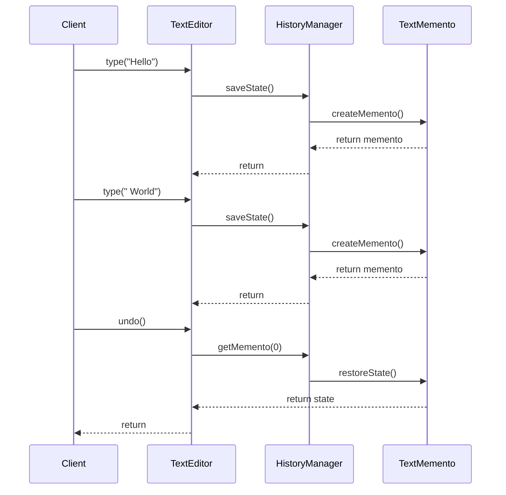
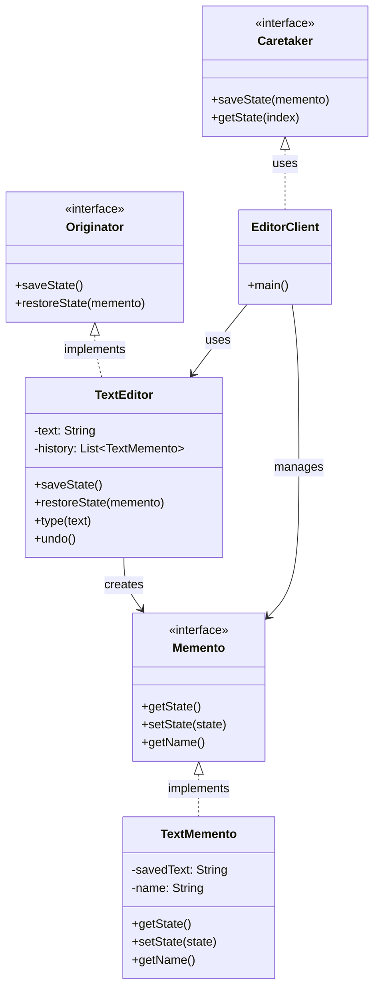

Memento Pattern là một behavioral design pattern cho phép lưu và khôi phục trạng thái của một object mà không vi phạm nguyên tắc đóng gói 14:1. Hãy cùng tìm hiểu pattern này thông qua một ví dụ thực tế về trình soạn thảo văn bản.

###  1. Sequence Diagram - Luồng Hoạt Động



Trong diagram trên:

- Mũi tên liền (->>) thể hiện cuộc gọi phương thức
- Mũi tên đứt (-->>) thể hiện trả về kết quả
- Luồng tương tác được đọc từ trên xuống dưới
- Thể hiện cách trạng thái được lưu và khôi phục

###  2. Class Diagram - Cấu Trúc Chi Tiết



###  3. Ví Dụ Mã Code

```java
// Memento interface
interface Memento {
    String getState();
    void setState(String state);
    String getName();
}

// Originator interface
interface Originator {
    Memento saveState();
    void restoreState(Memento memento);
}

// Concrete Memento
class TextMemento implements Memento {
    private String savedText;
    private String name;
    
    public TextMemento(String text) {
        this.savedText = text;
        this.name = "Snapshot " + text.substring(0, Math.min(10, text.length()));
    }
    
    @Override
    public String getState() {
        return savedText;
    }
    
    @Override
    public void setState(String state) {
        this.savedText = state;
    }
    
    @Override
    public String getName() {
        return name;
    }
}

// Originator implementation
class TextEditor implements Originator {
    private String text;
    private List<Memento> history;
    
    public TextEditor() {
        this.text = "";
        this.history = new ArrayList<>();
    }
    
    public void type(String newText) {
        this.text += newText;
        saveState();
    }
    
    @Override
    public Memento saveState() {
        Memento memento = new TextMemento(text);
        history.add(memento);
        return memento;
    }
    
    @Override
    public void restoreState(Memento memento) {
        this.text = memento.getState();
    }
    
    public void undo() {
        if (history.size() > 1) {
            history.remove(history.size() - 1);
            restoreState(history.get(history.size() - 1));
        }
    }
    
    public String getText() {
        return text;
    }
}

// Caretaker implementation
class HistoryManager {
    private List<Memento> mementos;
    
    public HistoryManager() {
        this.mementos = new ArrayList<>();
    }
    
    public void saveState(Memento memento) {
        mementos.add(memento);
    }
    
    public Memento getState(int index) {
        return mementos.get(index);
    }
}

// Client code
public class EditorClient {
    public static void main(String[] args) {
        TextEditor editor = new TextEditor();
        HistoryManager history = new HistoryManager();
        
        editor.type("Hello");
        history.saveState(editor.saveState());
        
        editor.type(" World");
        history.saveState(editor.saveState());
        
        System.out.println("Current text: " + editor.getText());
        editor.undo();
        System.out.println("After undo: " + editor.getText());
    }
}
```

###  4. Cách Hoạt Động

1. **Memento Pattern**:
- Cho phép lưu trạng thái của object mà không vi phạm đóng gói
- Tạo snapshot của trạng thái để có thể khôi phục sau này
- Giúp thực hiện undo/redo functionality


2. **Ứng Dụng Thực Tế**:
- Trình soạn thảo văn bản (undo/redo)
- Game save/load system
- Database transaction management
- Version control systems


3. **Lợi Ích**:
- Bảo vệ tính đóng gói của Originator
- Cho phép khôi phục trạng thái một cách linh hoạt
- Dễ dàng mở rộng để thêm các loại snapshot khác
- Giúp quản lý lịch sử thay đổi hiệu quả


Pattern này đặc biệt hữu ích khi cần lưu và khôi phục trạng thái của object mà không muốn lộ chi tiết nội bộ của object đó 14:1.