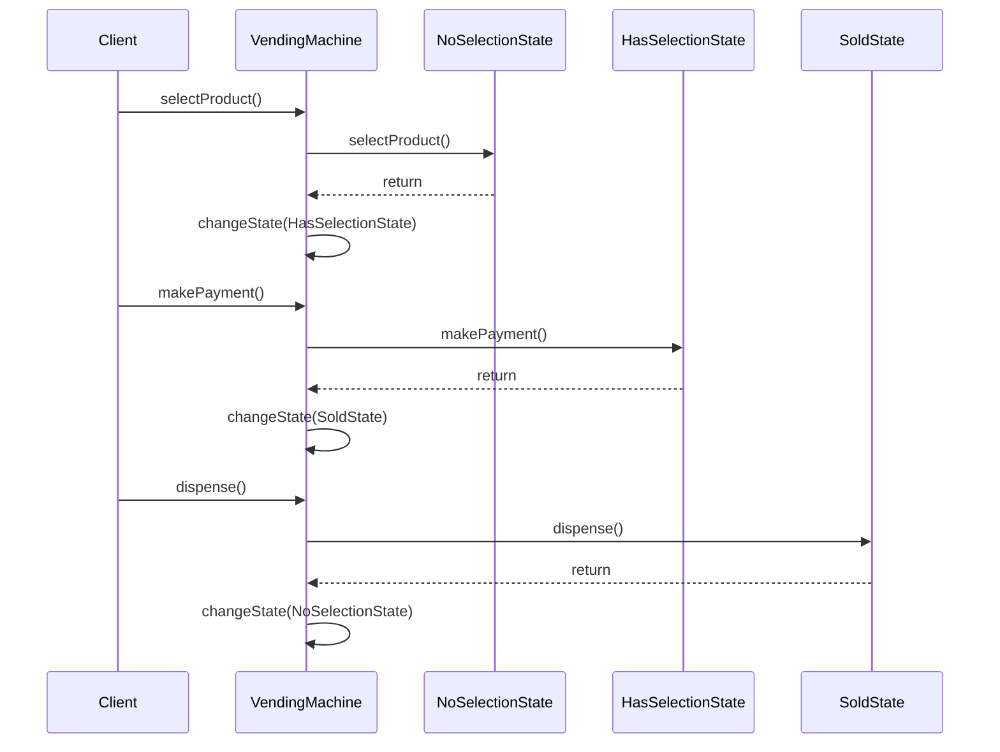
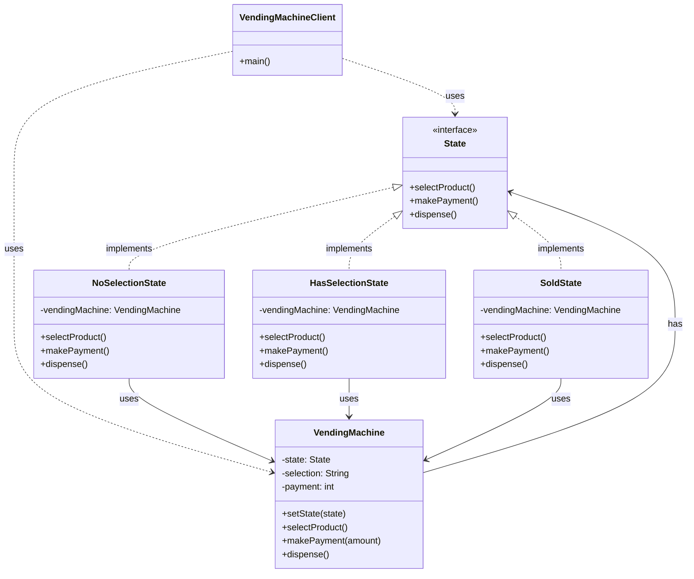

State Pattern là một behavioral design pattern cho phép một object thay đổi hành vi của nó khi trạng thái nội bộ của nó thay đổi 16:1. Hãy cùng tìm hiểu pattern này thông qua một ví dụ thực tế về máy bán hàng tự động.

###  1. Sequence Diagram - Luồng Hoạt Động



Trong diagram trên:

- Mũi tên liền (->>) thể hiện cuộc gọi phương thức
- Mũi tên đứt (-->>) thể hiện trả về kết quả
- Luồng tương tác được đọc từ trên xuống dưới
- Thể hiện cách trạng thái được chuyển đổi

###  2. Class Diagram - Cấu Trúc Chi Tiết



###  3. Ví Dụ Mã Code (với giải thích chi tiết)

```java
// State interface - Định nghĩa các phương thức có thể thực hiện trong mỗi trạng thái
interface State {
    void selectProduct();
    void makePayment();
    void dispense();
}

// Concrete State - Trạng thái không có sản phẩm được chọn
class NoSelectionState implements State {
    private VendingMachine vendingMachine;

    public NoSelectionState(VendingMachine vendingMachine) {
        this.vendingMachine = vendingMachine;
    }

    @Override
    public void selectProduct() {
        System.out.println("Đã chọn sản phẩm");
        vendingMachine.setState(vendingMachine.getHasSelectionState());
    }

    @Override
    public void makePayment() {
        System.out.println("Vui lòng chọn sản phẩm trước");
    }

    @Override
    public void dispense() {
        System.out.println("Vui lòng chọn sản phẩm trước");
    }
}

// Concrete State - Trạng thái đã chọn sản phẩm
class HasSelectionState implements State {
    private VendingMachine vendingMachine;

    public HasSelectionState(VendingMachine vendingMachine) {
        this.vendingMachine = vendingMachine;
    }

    @Override
    public void selectProduct() {
        System.out.println("Đã có sản phẩm được chọn");
    }

    @Override
    public void makePayment() {
        System.out.println("Đã thanh toán");
        vendingMachine.setState(vendingMachine.getSoldState());
    }

    @Override
    public void dispense() {
        System.out.println("Vui lòng thanh toán trước");
    }
}

// Concrete State - Trạng thái đã bán
class SoldState implements State {
    private VendingMachine vendingMachine;

    public SoldState(VendingMachine vendingMachine) {
        this.vendingMachine = vendingMachine;
    }

    @Override
    public void selectProduct() {
        System.out.println("Vui lòng đợi giao dịch hoàn tất");
    }

    @Override
    public void makePayment() {
        System.out.println("Đã thanh toán");
    }

    @Override
    public void dispense() {
        System.out.println("Cảm ơn bạn đã mua hàng!");
        vendingMachine.setState(vendingMachine.getNoSelectionState());
    }
}

// Context - Máy bán hàng tự động
class VendingMachine {
    private State state;
    private State noSelectionState;
    private State hasSelectionState;
    private State soldState;
    private String selection;
    private int payment;

    public VendingMachine() {
        noSelectionState = new NoSelectionState(this);
        hasSelectionState = new HasSelectionState(this);
        soldState = new SoldState(this);
        state = noSelectionState;
        selection = "";
        payment = 0;
    }

    public void setState(State state) {
        this.state = state;
    }

    public State getNoSelectionState() {
        return noSelectionState;
    }

    public State getHasSelectionState() {
        return hasSelectionState;
    }

    public State getSoldState() {
        return soldState;
    }

    public void selectProduct() {
        state.selectProduct();
    }

    public void makePayment(int amount) {
        payment = amount;
        state.makePayment();
    }

    public void dispense() {
        state.dispense();
    }
}

// Client code - Code sử dụng
public class VendingMachineClient {
    public static void main(String[] args) {
        VendingMachine vendingMachine = new VendingMachine();

        vendingMachine.selectProduct();    // Chọn sản phẩm
        vendingMachine.makePayment(10000);  // Thanh toán
        vendingMachine.dispense();          // Lấy hàng
    }
}
```

###  4. Cách Hoạt Động

1. **State Pattern**:
  - Cho phép một object thay đổi hành vi của nó khi trạng thái nội bộ thay đổi
  - Tách biệt hành vi phụ thuộc vào trạng thái ra thành các class riêng biệt
  - Giúp quản lý các trạng thái phức tạp một cách linh hoạt


2. **Ứng Dụng Thực Tế**:
  - Máy bán hàng tự động
  - Hệ thống thanh toán trực tuyến
  - Game state management
  - Workflow automation


3. **Lợi Ích**:
  - Tách biệt hành vi phụ thuộc vào trạng thái
  - Dễ dàng thêm các trạng thái mới
  - Giảm thiểu các điều kiện if-else phức tạp
  - Tăng tính linh hoạt trong việc thay đổi hành vi


Pattern này đặc biệt hữu ích khi cần thay đổi hành vi của object dựa trên trạng thái của nó.