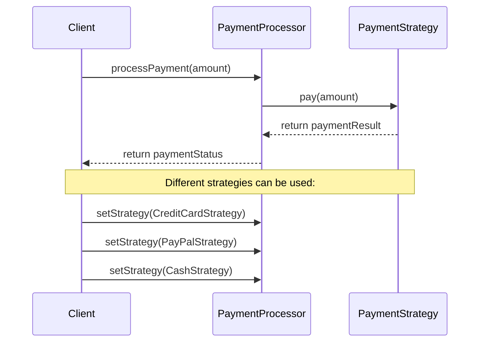
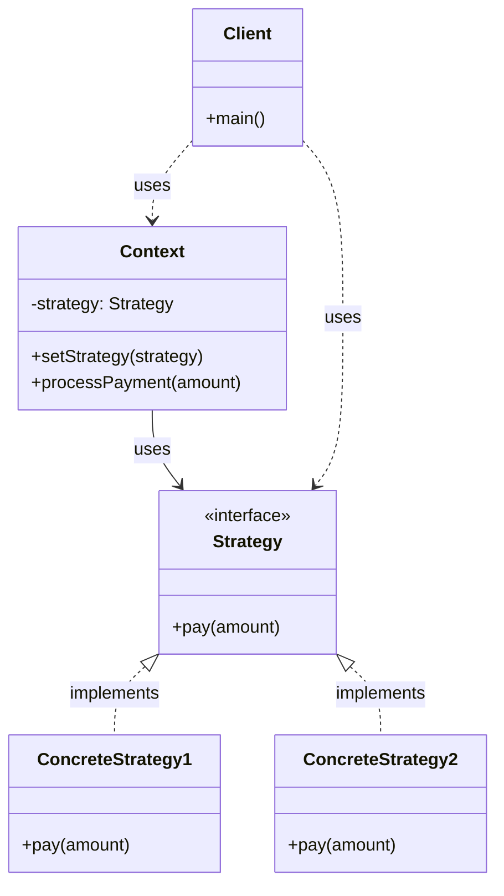

Strategy Pattern là một behavioral design pattern cho phép định nghĩa một họ các thuật toán, đóng gói từng thuật toán và làm cho chúng có thể thay thế cho nhau 17:1. Hãy cùng tìm hiểu pattern này thông qua một ví dụ thực tế về hệ thống thanh toán.

###  1. Sequence Diagram - Luồng Hoạt Động



Trong diagram trên:

- Mũi tên liền (->>) thể hiện cuộc gọi phương thức
- Mũi tên đứt (-->>) thể hiện trả về kết quả
- Luồng tương tác được đọc từ trên xuống dưới
- Thể hiện cách các chiến lược khác nhau được sử dụng

###  2. Class Diagram - Cấu Trúc Chi Tiết



###  3. Ví Dụ Mã Code (với giải thích chi tiết)

```java
// Strategy interface - Định nghĩa phương thức chung cho tất cả các chiến lược
interface PaymentStrategy {
    void pay(double amount);
}

// Concrete Strategy - Chiến lược thanh toán bằng thẻ tín dụng
class CreditCardStrategy implements PaymentStrategy {
    private String name;
    private String cardNumber;
    private String cvv;
    private String expiryDate;

    public CreditCardStrategy(String name, String cardNumber,
                             String cvv, String expiryDate) {
        this.name = name;
        this.cardNumber = cardNumber;
        this.cvv = cvv;
        this.expiryDate = expiryDate;
    }

    @Override
    public void pay(double amount) {
        System.out.printf("Thanh toán $%.2f bằng thẻ tín dụng %s%n",
                         amount, cardNumber);
        // Xử lý thanh toán thẻ tín dụng
    }
}

// Concrete Strategy - Chiến lược thanh toán bằng PayPal
class PayPalStrategy implements PaymentStrategy {
    private String email;

    public PayPalStrategy(String email) {
        this.email = email;
    }

    @Override
    public void pay(double amount) {
        System.out.printf("Thanh toán $%.2f qua PayPal %s%n",
                         amount, email);
        // Xử lý thanh toán PayPal
    }
}

// Concrete Strategy - Chiến lược thanh toán bằng tiền mặt
class CashStrategy implements PaymentStrategy {
    @Override
    public void pay(double amount) {
        System.out.printf("Thanh toán $%.2f bằng tiền mặt%n", amount);
        // Xử lý thanh toán tiền mặt
    }
}

// Context - Xử lý thanh toán
class PaymentProcessor {
    private PaymentStrategy strategy;

    public void setStrategy(PaymentStrategy strategy) {
        this.strategy = strategy;
    }

    public void processPayment(double amount) {
        strategy.pay(amount);
    }
}

// Client code - Code sử dụng
public class PaymentClient {
    public static void main(String[] args) {
        PaymentProcessor paymentProcessor = new PaymentProcessor();

        // Thanh toán bằng thẻ tín dụng
        paymentProcessor.setStrategy(new CreditCardStrategy(
            "John Doe", "1234-5678-9012-3456", "123", "12/2025"));
        paymentProcessor.processPayment(100.00);

        // Thanh toán bằng PayPal
        paymentProcessor.setStrategy(new PayPalStrategy("john@example.com"));
        paymentProcessor.processPayment(150.00);

        // Thanh toán bằng tiền mặt
        paymentProcessor.setStrategy(new CashStrategy());
        paymentProcessor.processPayment(50.00);
    }
}
```

###  4. Cách Hoạt Động

1. **Strategy Pattern**:
  - Định nghĩa một họ các thuật toán
  - Đóng gói từng thuật toán trong một class riêng biệt
  - Cho phép các thuật toán có thể thay thế cho nhau


2. **Ứng Dụng Thực Tế**:
  - Hệ thống thanh toán (thẻ tín dụng, PayPal, tiền mặt)
  - Các thuật toán sắp xếp dữ liệu
  - Các chiến lược tìm kiếm
  - Các thuật toán mã hóa


3. **Lợi Ích**:
  - Tách biệt thuật toán khỏi client sử dụng
  - Dễ dàng thêm các thuật toán mới
  - Cho phép thay đổi thuật toán tại runtime
  - Tăng tính linh hoạt trong việc sử dụng các thuật toán khác nhau


Pattern này đặc biệt hữu ích khi cần có nhiều cách khác nhau để giải quyết một vấn đề và muốn có thể thay đổi cách giải quyết một cách linh hoạt 17:1.