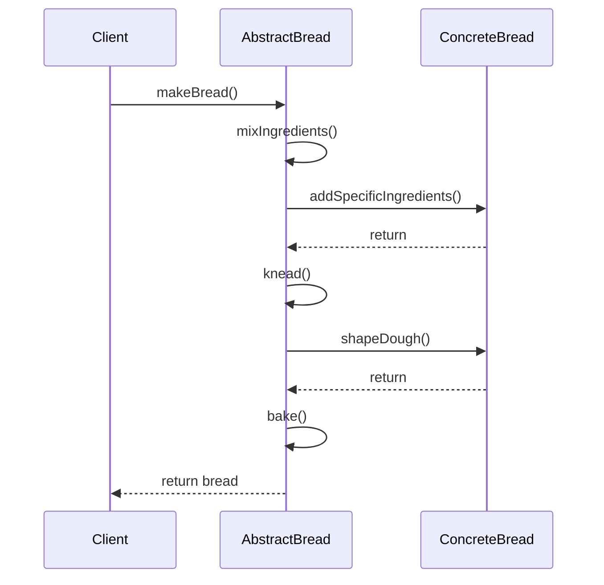
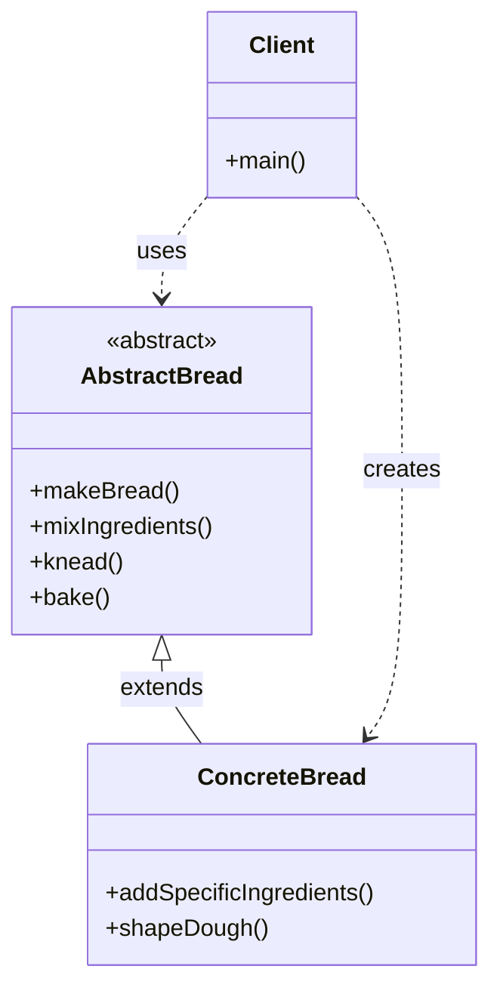

Template Method Pattern là một behavioral design pattern cho phép định nghĩa một thuật toán trong một class cha, trong khi cho phép các class con override các bước cụ thể của thuật toán đó 18:1. Hãy cùng tìm hiểu pattern này thông qua một ví dụ thực tế về hệ thống làm bánh.

###  1. Sequence Diagram - Luồng Hoạt Động



Trong diagram trên:

- Mũi tên liền (->>) thể hiện cuộc gọi phương thức
- Mũi tên đứt (-->>) thể hiện trả về kết quả
- Luồng tương tác được đọc từ trên xuống dưới
- Thể hiện cách các bước của thuật toán được thực hiện

###  2. Class Diagram - Cấu Trúc Chi Tiết



###  3. Ví Dụ Mã Code (với giải thích chi tiết)

```java
// Abstract class - Lớp trừu tượng cho các loại bánh
abstract class AbstractBread {
    // Template method - Định nghĩa thuật toán chung
    public final void makeBread() {
        mixIngredients();
        knead();
        bake();
    }
    
    // Primitive operations - Các bước cơ bản
    protected void mixIngredients() {
        System.out.println("Trộn nguyên liệu cơ bản");
    }
    
    protected void knead() {
        System.out.println("Nhồi bột");
    }
    
    protected void bake() {
        System.out.println("Nướng bánh");
    }
}

// Concrete class - Lớp cụ thể cho bánh mì
class Bread extends AbstractBread {
    @Override
    protected void mixIngredients() {
        System.out.println("Trộn bột mì, men, muối và đường");
    }
    
    @Override
    protected void knead() {
        System.out.println("Nhồi bột trong 10 phút");
    }
    
    @Override
    protected void bake() {
        System.out.println("Nướng ở 200°C trong 45 phút");
    }
}

// Concrete class - Lớp cụ thể cho bánh ngọt
class Cake extends AbstractBread {
    @Override
    protected void mixIngredients() {
        System.out.println("Trộn bột, đường, trứng và sữa");
    }
    
    @Override
    protected void knead() {
        System.out.println("Trộn đều các nguyên liệu");
    }
    
    @Override
    protected void bake() {
        System.out.println("Nướng ở 180°C trong 30 phút");
    }
}

// Client code - Code sử dụng
public class Bakery {
    public static void main(String[] args) {
        // Làm bánh mì
        AbstractBread bread = new Bread();
        System.out.println("Làm bánh mì:");
        bread.makeBread();
        
        System.out.println("\nLàm bánh ngọt:");
        AbstractBread cake = new Cake();
        cake.makeBread();
    }
}
```

###  4. Cách Hoạt Động

1. **Template Method Pattern**:
- Định nghĩa một thuật toán trong class cha
- Cho phép các class con override các bước cụ thể
- Bảo vệ các bước quan trọng không bị override


2. **Ứng Dụng Thực Tế**:
- Hệ thống làm bánh (như ví dụ trên)
- Quy trình sản xuất
- Workflow automation
- Game development


3. **Lợi Ích**:
- Tái sử dụng code
- Đảm bảo tính nhất quán của thuật toán
- Dễ dàng thêm các biến thể mới
- Tăng tính linh hoạt trong việc tùy chỉnh


Pattern này đặc biệt hữu ích khi cần có một thuật toán cơ sở nhưng cho phép các class con tùy chỉnh một số bước cụ thể của thuật toán đó 18:1.