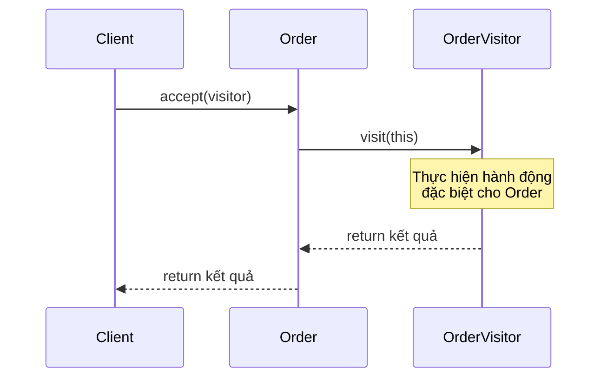
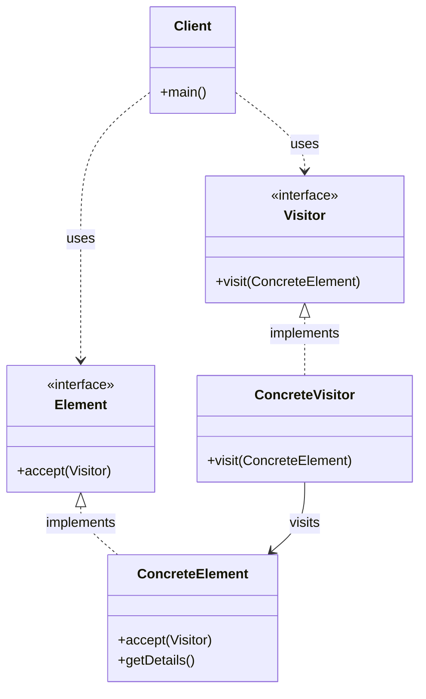

Visitor Pattern là một behavioral design pattern cho phép thêm các hành vi mới vào một class mà không cần thay đổi code của class đó 14:3. Hãy cùng tìm hiểu pattern này thông qua một ví dụ thực tế về hệ thống quản lý đơn hàng.

###  1. Sequence Diagram - Luồng Hoạt Động



Trong diagram trên:

- Mũi tên liền (->>) thể hiện cuộc gọi phương thức
- Mũi tên đứt (-->>) thể hiện trả về kết quả
- Luồng tương tác được đọc từ trên xuống dưới
- Thể hiện cách Visitor thực hiện hành động trên Element

###  2. Class Diagram - Cấu Trúc Chi Tiết



###  3. Ví Dụ Mã Code (với giải thích chi tiết)

```java
// Element interface - Định nghĩa phương thức accept cho Visitor
interface OrderElement {
    void accept(OrderVisitor visitor);
}

// Concrete Element - Lớp đơn hàng
class Order implements OrderElement {
    private String orderId;
    private double amount;
    private String status;
    
    public Order(String orderId, double amount, String status) {
        this.orderId = orderId;
        this.amount = amount;
        this.status = status;
    }
    
    @Override
    public void accept(OrderVisitor visitor) {
        visitor.visit(this);
    }
    
    public String getOrderId() {
        return orderId;
    }
    
    public double getAmount() {
        return amount;
    }
    
    public String getStatus() {
        return status;
    }
}

// Visitor interface - Định nghĩa các phương thức visit
interface OrderVisitor {
    void visit(Order order);
}

// Concrete Visitor - Visitor để tính thuế
class TaxCalculator implements OrderVisitor {
    private static final double TAX_RATE = 0.1;
    
    @Override
    public void visit(Order order) {
        double taxAmount = order.getAmount() * TAX_RATE;
        System.out.printf("Thuế cho đơn hàng %s: %.2f%n", 
                         order.getOrderId(), taxAmount);
    }
}

// Concrete Visitor - Visitor để xuất báo cáo
class ReportGenerator implements OrderVisitor {
    @Override
    public void visit(Order order) {
        System.out.printf("Báo cáo đơn hàng: %s%n", order.getOrderId());
        System.out.printf("  Số tiền: %.2f%n", order.getAmount());
        System.out.printf("  Trạng thái: %s%n", order.getStatus());
    }
}

// Client code - Code sử dụng
public class OrderProcessor {
    public static void main(String[] args) {
        // Tạo danh sách đơn hàng
        Order[] orders = new Order[] {
            new Order("ORD001", 1000.0, "Pending"),
            new Order("ORD002", 2000.0, "Shipped"),
            new Order("ORD003", 1500.0, "Delivered")
        };
        
        // Tạo các Visitor
        OrderVisitor taxCalculator = new TaxCalculator();
        OrderVisitor reportGenerator = new ReportGenerator();
        
        // Sử dụng Visitor để xử lý đơn hàng
        System.out.println("Tính thuế cho các đơn hàng:");
        for (Order order : orders) {
            order.accept(taxCalculator);
        }
        
        System.out.println("\nXuất báo cáo cho các đơn hàng:");
        for (Order order : orders) {
            order.accept(reportGenerator);
        }
    }
}
```

###  4. Cách Hoạt Động

1. **Visitor Pattern**:
- Cho phép thêm các hành vi mới vào class mà không cần thay đổi code của class đó
- Tách biệt đối tượng và các thao tác được thực hiện trên đối tượng
- Cho phép thêm các thao tác mới mà không cần thay đổi code hiện có


2. **Ứng Dụng Thực Tế**:
- Hệ thống quản lý đơn hàng (như ví dụ trên)
- Xử lý file và thư mục
- Hệ thống báo cáo
- Xử lý sự kiện trong ứng dụng


3. **Lợi Ích**:
- Tuân thủ nguyên tắc đóng mở (Open/Closed Principle)
- Dễ dàng thêm các thao tác mới
- Tách biệt đối tượng và các thao tác
- Cho phép thực hiện các thao tác phức tạp trên các đối tượng khác nhau


Pattern này đặc biệt hữu ích khi cần thêm các hành vi mới vào một hệ thống mà không muốn thay đổi code hiện có 14:6.