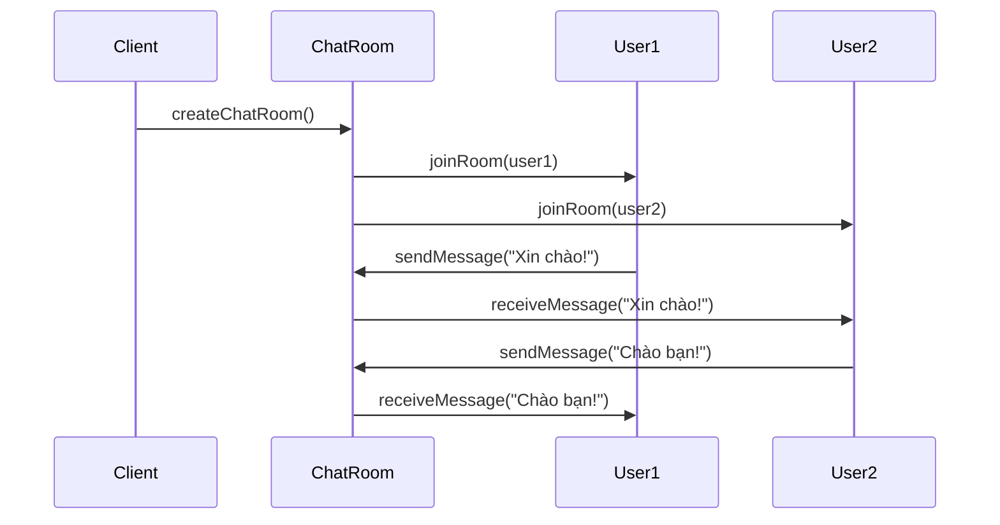
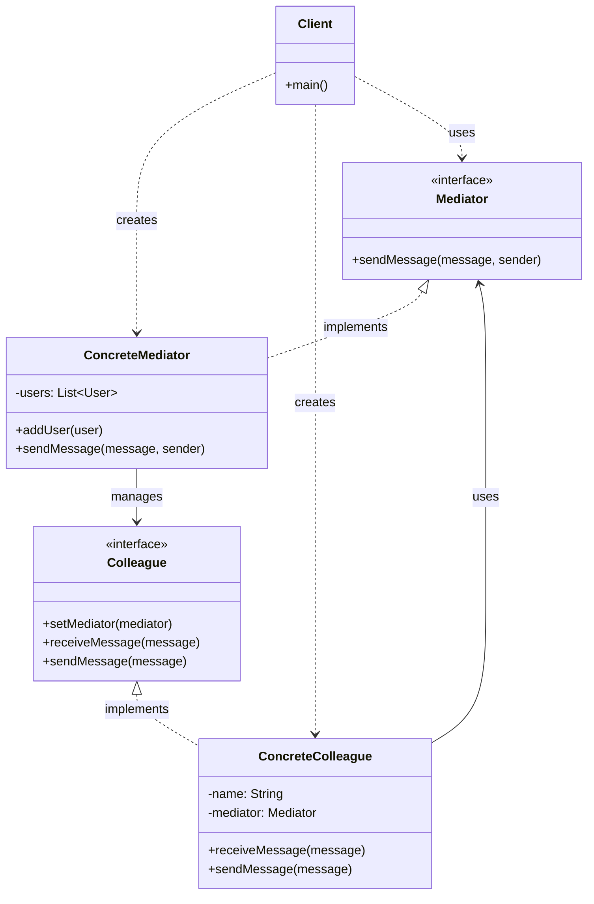

Tôi sẽ giải thích Mediator Pattern theo cách tương tự, với các diagram và ví dụ thực tế.

###  1. Sequence Diagram - Luồng Hoạt Động



Trong diagram trên:

- Mũi tên liền (->>) thể hiện cuộc gọi phương thức
- Mũi tên đứt (-..>) thể hiện mối quan hệ sử dụng
- Luồng tương tác được đọc từ trên xuống dưới
- Thể hiện cách các thành viên phòng chat giao tiếp thông qua Mediator

###  2. Class Diagram - Cấu Trúc Chi Tiết



Trong diagram trên:

- Mũi tên tam giác (..|>) thể hiện quan hệ kế thừa (implements)
- Mũi tên đứt (..>) thể hiện quan hệ sử dụng (uses/creates)
- Các thành phần được đánh dấu <<interface>> là interface
- Các thành phần khác là classes

###  3. Ví Dụ Mã Code

```java
// Interface Mediator
public interface ChatRoomMediator {
    void sendMessage(String message, User sender);
    void addUser(User user);
}

// Concrete Mediator
public class ChatRoom implements ChatRoomMediator {
    private List<User> users = new ArrayList<>();
    
    @Override
    public void sendMessage(String message, User sender) {
        for (User user : users) {
            if (user != sender) {
                user.receiveMessage(message);
            }
        }
    }
    
    @Override
    public void addUser(User user) {
        users.add(user);
    }
}

// Interface Colleague
public interface User {
    void receiveMessage(String message);
    void sendMessage(String message);
    String getName();
}

// Concrete Colleague
public class ChatUser implements User {
    private String name;
    private ChatRoomMediator chatRoom;
    
    public ChatUser(String name, ChatRoomMediator chatRoom) {
        this.name = name;
        this.chatRoom = chatRoom;
    }
    
    @Override
    public void receiveMessage(String message) {
        System.out.println(name + " nhận được: " + message);
    }
    
    @Override
    public void sendMessage(String message) {
        System.out.println(name + " gửi: " + message);
        chatRoom.sendMessage(message, this);
    }
    
    @Override
    public String getName() {
        return name;
    }
}

// Client
public class Client {
    public static void main(String[] args) {
        // Tạo phòng chat
        ChatRoomMediator chatRoom = new ChatRoom();
        
        // Tạo người dùng
        User user1 = new ChatUser("Nam", chatRoom);
        User user2 = new ChatUser("Hoa", chatRoom);
        
        // Thêm người dùng vào phòng chat
        chatRoom.addUser(user1);
        chatRoom.addUser(user2);
        
        // Gửi tin nhắn
        user1.sendMessage("Xin chào mọi người!");
        user2.sendMessage("Chào bạn Nam!");
    }
}
```

###  4. Cách Hoạt Động

1. **Mediator Pattern**:
- Giúp giảm sự phụ thuộc giữa các đối tượng
- Tập trung hóa việc giao tiếp thông qua một đối tượng trung gian
- Cho phép thay đổi cách các đối tượng tương tác một cách độc lập


2. **Ứng Dụng Thực Tế**:
- Phòng chat trực tuyến
- Hệ thống thông báo
- Điều phối giao tiếp giữa nhiều thành phần


3. **Lợi Ích**:
- Giảm độ phức tạp của hệ thống
- Dễ dàng mở rộng và bảo trì
- Tăng tính linh hoạt trong việc thay đổi logic giao tiếp


Pattern này đặc biệt hữu ích khi cần điều phối giao tiếp giữa nhiều đối tượng mà không muốn chúng phụ thuộc trực tiếp vào nhau 0:0.