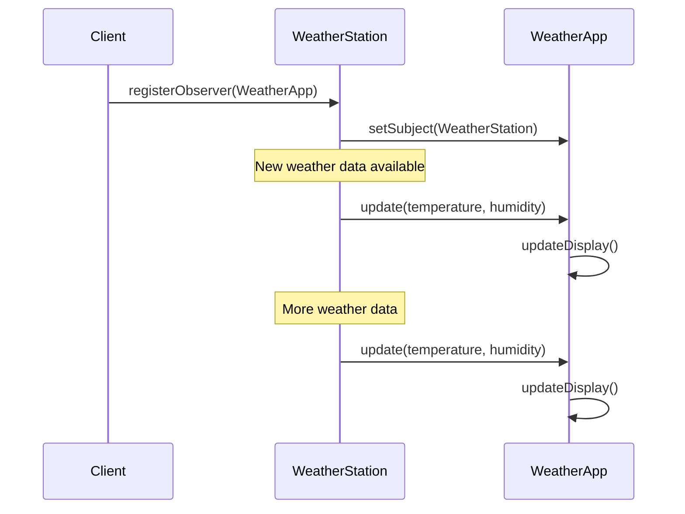
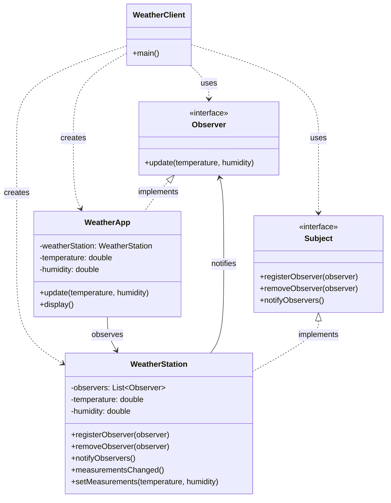

Observer Pattern là một behavioral design pattern cho phép một object thông báo cho các object khác về những thay đổi của nó 15:1. Hãy cùng tìm hiểu pattern này thông qua một ví dụ thực tế về hệ thống thông báo thời tiết.

###  1. Sequence Diagram - Luồng Hoạt Động



Trong diagram trên:

- Mũi tên liền (->>) thể hiện cuộc gọi phương thức
- Mũi tên đứt (-->>) thể hiện trả về kết quả
- Luồng tương tác được đọc từ trên xuống dưới
- Thể hiện cách Observer nhận thông báo từ Subject

###  2. Class Diagram - Cấu Trúc Chi Tiết



code###  3. Ví Dụ Mã Code (với giải thích chi tiết)

```java
// Observer interface - Định nghĩa phương thức update cho tất cả observer
interface Observer {
    void update(double temperature, double humidity);
}

// Subject interface - Định nghĩa các phương thức quản lý observer
interface Subject {
    void registerObserver(Observer observer);
    void removeObserver(Observer observer);
    void notifyObservers();
}

// Concrete Subject - Trạm thời tiết (WeatherStation)
class WeatherStation implements Subject {
    // Danh sách các observer đang theo dõi
    private List<Observer> observers;
    private double temperature;
    private double humidity;
    
    public WeatherStation() {
        this.observers = new ArrayList<>();
    }
    
    // Đăng ký một observer mới
    @Override
    public void registerObserver(Observer observer) {
        observers.add(observer);
    }
    
    // Hủy đăng ký một observer
    @Override
    public void removeObserver(Observer observer) {
        observers.remove(observer);
    }
    
    // Thông báo cho tất cả observer về sự thay đổi
    @Override
    public void notifyObservers() {
        for (Observer observer : observers) {
            observer.update(temperature, humidity);
        }
    }
    
    // Thông báo cho observer khi có thay đổi
    public void measurementsChanged() {
        notifyObservers();
    }
    
    // Cập nhật dữ liệu thời tiết
    public void setMeasurements(double temperature, double humidity) {
        this.temperature = temperature;
        this.humidity = humidity;
        measurementsChanged();
    }
}

// Concrete Observer - Ứng dụng thời tiết (WeatherApp)
class WeatherApp implements Observer {
    private WeatherStation weatherStation;
    private double temperature;
    private double humidity;
    
    public WeatherApp(WeatherStation weatherStation) {
        this.weatherStation = weatherStation;
        weatherStation.registerObserver(this);
    }
    
    // Cập nhật dữ liệu khi nhận được thông báo
    @Override
    public void update(double temperature, double humidity) {
        this.temperature = temperature;
        this.humidity = humidity;
        display();
    }
    
    // Hiển thị dữ liệu thời tiết
    public void display() {
        System.out.printf("Nhiệt độ: %.1f°C - Độ ẩm: %.1f%%\n", 
                         temperature, humidity);
    }
}

// Client code - Code sử dụng
public class WeatherClient {
    public static void main(String[] args) {
        // Tạo trạm thời tiết
        WeatherStation weatherStation = new WeatherStation();
        
        // Tạo ứng dụng thời tiết
        WeatherApp weatherApp = new WeatherApp(weatherStation);
        
        // Cập nhật dữ liệu thời tiết
        weatherStation.setMeasurements(25.0, 65.0);
        weatherStation.setMeasurements(26.0, 70.0);
    }
}
```

###  4. Cách Hoạt Động

1. **Observer Pattern**:
- Cho phép một object thông báo cho các object khác về những thay đổi của nó
- Tạo mối quan hệ một-nhiều giữa các object
- Giúp cập nhật đồng bộ nhiều object khi có thay đổi


2. **Ứng Dụng Thực Tế**:
- Hệ thống thông báo thời tiết
- Feed mạng xã hội
- Hệ thống theo dõi giá cổ phiếu
- Event-driven architecture


3. **Lợi Ích**:
- Tăng tính linh hoạt trong việc thêm/bớt observer
- Giảm coupling giữa các object
- Dễ dàng mở rộng để thêm các loại observer mới
- Cho phép observer và subject thay đổi độc lập


Pattern này đặc biệt hữu ích khi cần thông báo cho nhiều object về những thay đổi của một object khác 15:1.