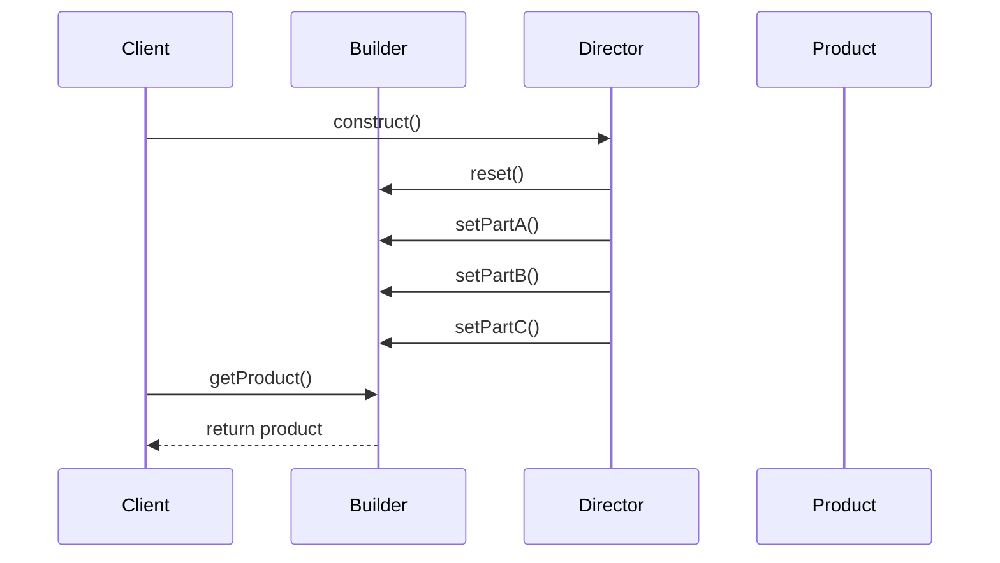
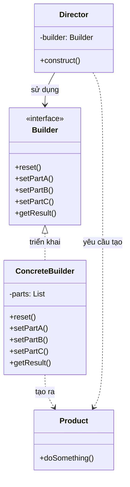

Tôi sẽ giải thích Builder Pattern với cả sequence diagram và class diagram để bạn dễ hiểu hơn:

###  1. Sequence Diagram - Luồng hoạt động



Trong sơ đồ trên:

- Mũi tên liền nét (->>) thể hiện việc gọi phương thức
- Mũi tên đứt nét (-->>) thể hiện việc trả về kết quả
- Luồng tương tác được đọc từ trên xuống dưới
- Thể hiện cách Director điều phối việc xây dựng sản phẩm

###  2. Class Diagram - Cấu trúc chi tiết



Trong sơ đồ trên:

- Mũi tên liền nét với tam giác (-->|>) thể hiện quan hệ kế thừa (implements)
- Mũi tên đứt nét (..>) thể hiện quan hệ sử dụng (uses)
- Các thành phần được đánh dấu <<interface>> là interface
- Các thành phần khác là class

Ví dụ code để minh họa:

```java
public interface Builder {
    void reset();
    void setPartA();
    void setPartB();
    void setPartC();
    Product getResult();
}

public class ConcreteBuilder implements Builder {
    private List<String> parts = new ArrayList<>();
    
    @Override
    public void reset() {
        parts.clear();
    }
    
    @Override
    public void setPartA() {
        parts.add("PartA");
    }
    
    @Override
    public void setPartB() {
        parts.add("PartB");
    }
    
    @Override
    public void setPartC() {
        parts.add("PartC");
    }
    
    @Override
    public Product getResult() {
        return new Product(parts);
    }
}

public class Director {
    private Builder builder;
    
    public Director(Builder builder) {
        this.builder = builder;
    }
    
    public void construct() {
        builder.reset();
        builder.setPartA();
        builder.setPartB();
        builder.setPartC();
    }
}

public class Client {
    public static void main(String[] args) {
        Builder builder = new ConcreteBuilder();
        Director director = new Director(builder);
        director.construct();
        Product product = builder.getResult();
    }
}
```

Builder Pattern cho phép tách biệt việc xây dựng một đối tượng phức tạp khỏi chính đối tượng đó, cho phép cùng một quá trình xây dựng tạo ra các đối tượng khác nhau.