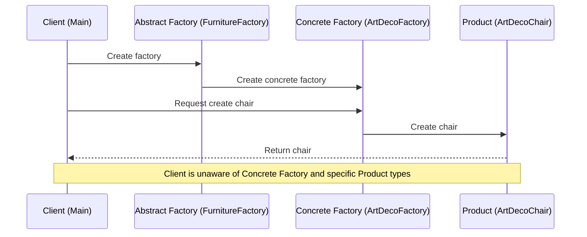
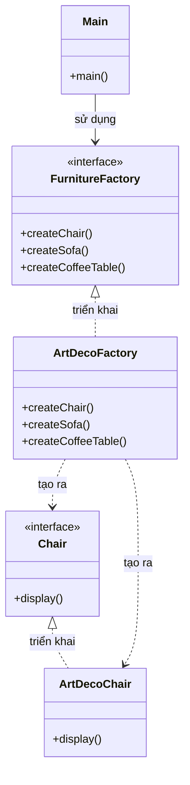

Abstract Factory Pattern với cả sequence diagram và class diagram để bạn dễ hiểu hơn:

###  1. Sequence Diagram - Luồng hoạt động

Trong sơ đồ trên:

- Mũi tên liền nét (->>) thể hiện việc gọi phương thức
- Mũi tên đứt nét (-->>) thể hiện việc trả về kết quả
- Mỗi participant được thể hiện với tên tiếng Anh và class tương ứng trong ngoặc
- Luồng tương tác được đọc từ trên xuống dưới

###  2. Class Diagram - Cấu trúc chi tiết

Trong sơ đồ trên:

- Mũi tên liền nét với tam giác (-->|>) thể hiện quan hệ kế thừa (implements)
- Mũi tên đứt nét (..>) thể hiện quan hệ sử dụng (uses)
- Các thành phần được đánh dấu <<interface>> là interface
- Các thành phần khác là class

Vậy để trả lời câu hỏi của bạn:

1. **Main**:
          - Là một class (Main)
  - Chứa method main() làm điểm khởi đầu chương trình
  - Không phải là interface

2. **Product (ArtDecoChair)**:
          - Chair là interface
  - ArtDecoChair là class triển khai interface Chair
  - Các sản phẩm khác cũng theo cấu trúc tương tự

3. **Factory**:
          - FurnitureFactory là interface
  - ArtDecoFactory là class triển khai interface FurnitureFactory
  - Các nhà máy khác cũng theo cấu trúc tương tự

Tất cả các interface đều được đánh dấu <<interface>> trong sơ đồ, và các class là các thành phần còn lại.