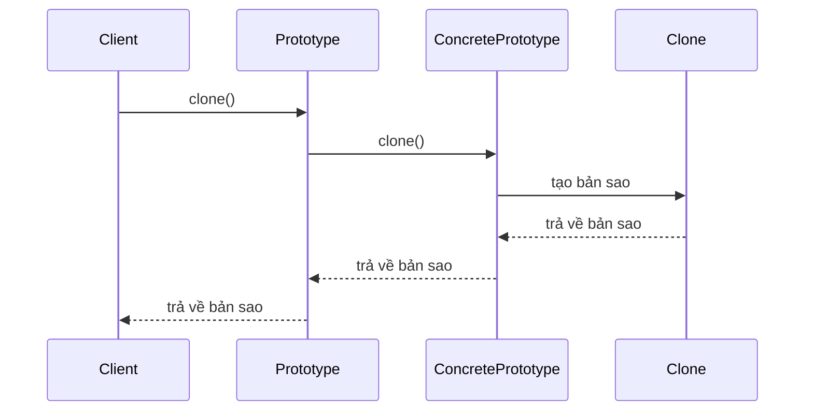
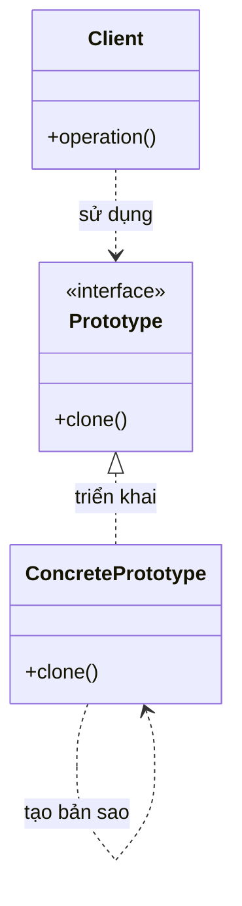

Tôi sẽ giải thích Prototype Pattern với cả sequence diagram và class diagram để bạn dễ hiểu hơn:

###  1. Sequence Diagram - Luồng hoạt động



Trong sơ đồ trên:

- Mũi tên liền nét (->>) thể hiện việc gọi phương thức
- Mũi tên đứt nét (-->>) thể hiện việc trả về kết quả
- Luồng tương tác được đọc từ trên xuống dưới
- Thể hiện quá trình tạo bản sao của đối tượng

###  2. Class Diagram - Cấu trúc chi tiết



Trong sơ đồ trên:

- Mũi tên liền nét với tam giác (-->|>) thể hiện quan hệ kế thừa (implements)
- Mũi tên đứt nét (..>) thể hiện quan hệ sử dụng (uses)
- Các thành phần được đánh dấu <<interface>> là interface
- Các thành phần khác là class

Ví dụ code để minh họa:

```java
public interface Prototype {
    Prototype clone();
}

public class ConcretePrototype implements Prototype {
    private String state;
    
    public ConcretePrototype(String state) {
        this.state = state;
    }
    
    @Override
    public Prototype clone() {
        return new ConcretePrototype(state);
    }
    
    public String getState() {
        return state;
    }
}

public class Client {
    public static void main(String[] args) {
        Prototype prototype = new ConcretePrototype("initial state");
        Prototype clone = prototype.clone();
        
        // prototype và clone là hai đối tượng khác nhau
        // nhưng có cùng trạng thái
    }
}
```

Prototype Pattern cho phép tạo bản sao của các đối tượng hiện có mà không cần phụ thuộc vào các class của chúng. Pattern này hữu ích khi cần tạo nhiều bản sao của cùng một đối tượng hoặc khi việc tạo đối tượng mới tốn kém.