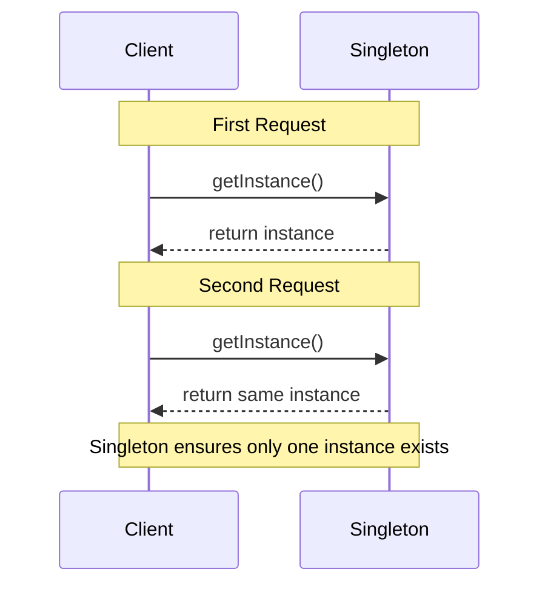
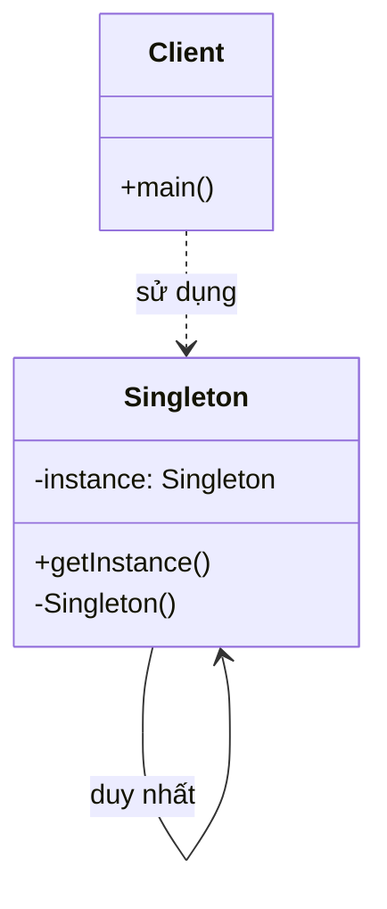

Tôi sẽ giải thích lại Singleton Pattern với cả sequence diagram và class diagram để bạn dễ hiểu hơn:

###  1. Sequence Diagram - Luồng hoạt động



Trong sơ đồ trên:

- Mũi tên liền nét (->>) thể hiện việc gọi phương thức
- Mũi tên đứt nét (-->>) thể hiện việc trả về kết quả
- Sơ đồ thể hiện hai lần yêu cầu instance, nhưng chỉ tạo một instance duy nhất
- Luồng tương tác được đọc từ trên xuống dưới

###  2. Class Diagram - Cấu trúc chi tiết



Trong sơ đồ trên:

- Mũi tên đứt nét (..>) thể hiện quan hệ sử dụng (uses)
- Mũi tên liền nét với vòng tròn (-->|>) thể hiện quan hệ self-reference (Singleton trỏ đến chính nó)
- Các dấu + thể hiện public methods/attributes
- Các dấu - thể hiện private methods/attributes

Ví dụ code để minh họa:

```java
public class Singleton {
    private static Singleton instance;
    private Singleton() {}
    
    public static Singleton getInstance() {
        if (instance == null) {
            instance = new Singleton();
        }
        return instance;
    }
}

public class Client {
    public static void main(String[] args) {
        Singleton instance1 = Singleton.getInstance();
        Singleton instance2 = Singleton.getInstance();
        // instance1 và instance2 là cùng một đối tượng
    }
}
```

Singleton Pattern đảm bảo chỉ có một instance duy nhất của class được tạo ra, và cung cấp một điểm truy cập toàn cục đến instance đó.