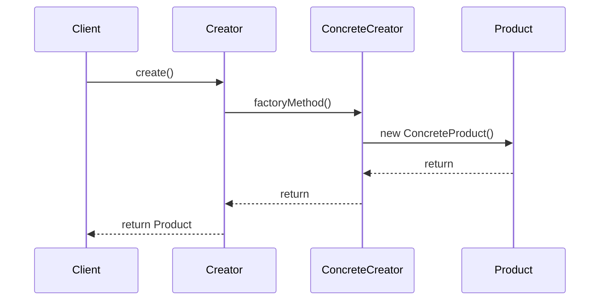
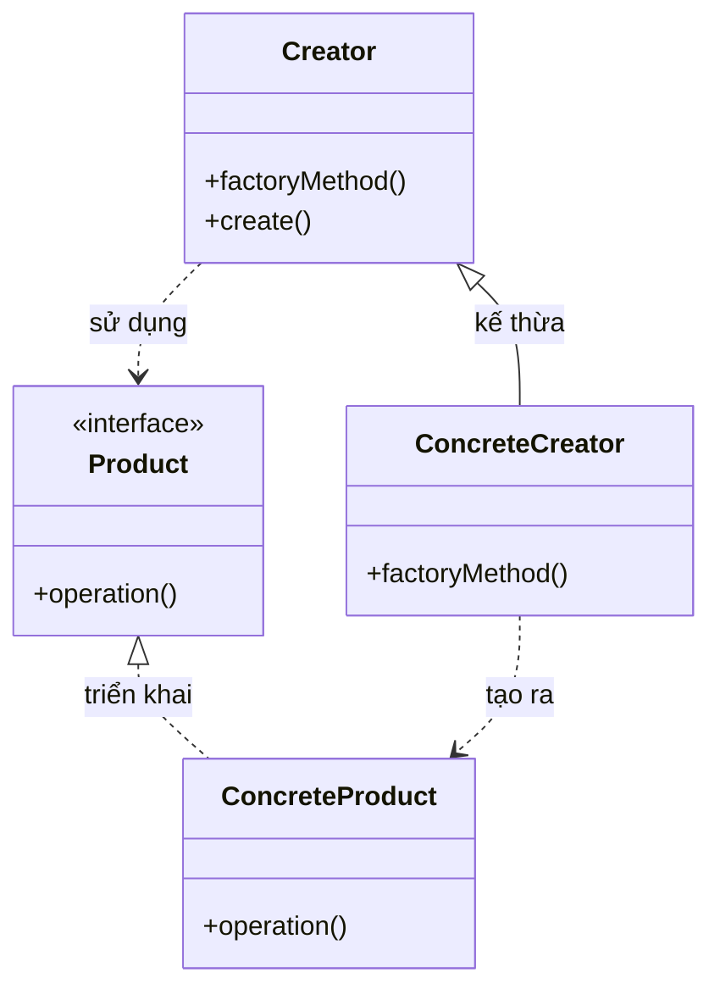

Tôi sẽ giải thích Factory Method Pattern với cả sequence diagram và class diagram để bạn dễ hiểu hơn:

###  1. Sequence Diagram - Luồng hoạt động



Trong sơ đồ trên:

- Mũi tên liền nét (->>) thể hiện việc gọi phương thức
- Mũi tên đứt nét (-->>) thể hiện việc trả về kết quả
- Luồng tương tác được đọc từ trên xuống dưới
- Thể hiện cách Creator ủy thác việc tạo sản phẩm cho ConcreteCreator

###  2. Class Diagram - Cấu trúc chi tiết



Trong sơ đồ trên:

- Mũi tên liền nét với tam giác (-->|>) thể hiện quan hệ kế thừa (extends)
- Mũi tên đứt nét (..>) thể hiện quan hệ sử dụng (uses)
- Các thành phần được đánh dấu <<interface>> là interface
- Các thành phần khác là class

Ví dụ code để minh họa:

```java
public abstract class Creator {
    public final Product create() {
        Product product = factoryMethod();
        // Các bước xử lý chung
        return product;
    }
    
    protected abstract Product factoryMethod();
}

public class ConcreteCreator extends Creator {
    @Override
    protected Product factoryMethod() {
        return new ConcreteProduct();
    }
}

public interface Product {
    void operation();
}

public class ConcreteProduct implements Product {
    @Override
    public void operation() {
        // Triển khai
    }
}

public class Client {
    public static void main(String[] args) {
        Creator creator = new ConcreteCreator();
        Product product = creator.create();
    }
}
```

Factory Method Pattern cho phép các class con quyết định loại đối tượng nào sẽ được tạo ra, trong khi vẫn cho phép class cha xác định cách đối tượng đó được tạo ra như thế nào.