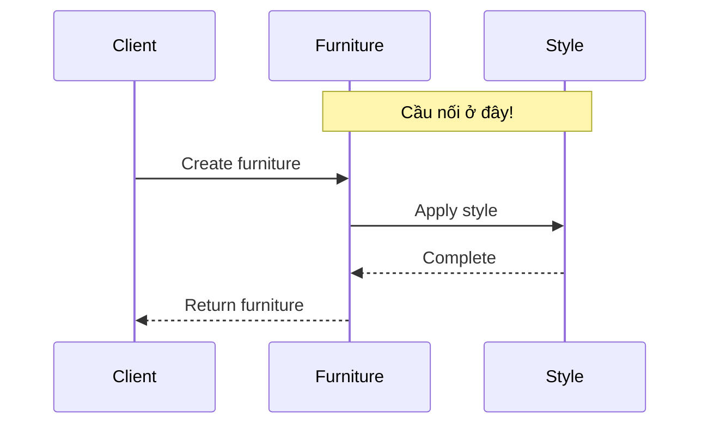
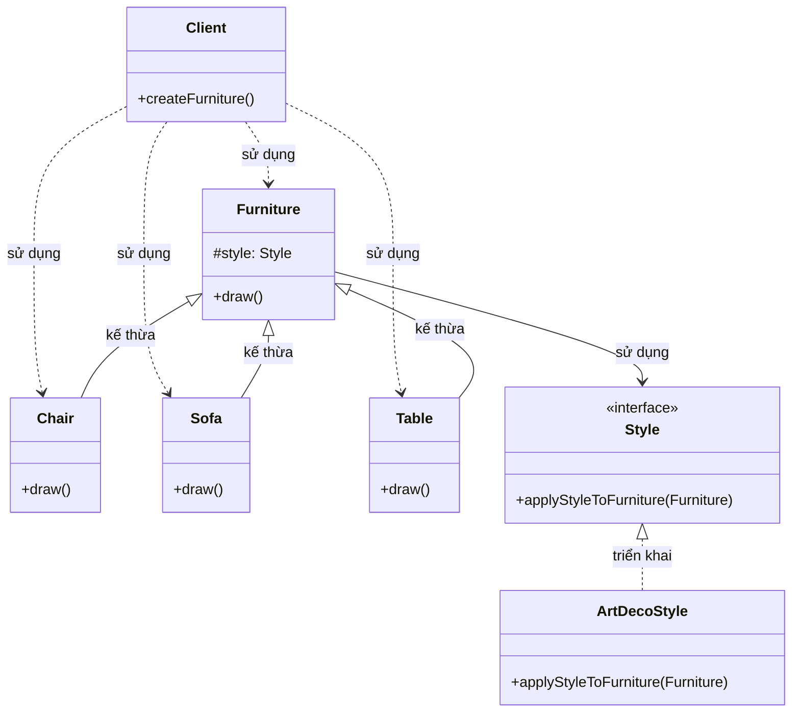

Tôi sẽ giải thích rõ hơn về vị trí của "cầu nối" trong Bridge Pattern:

###  1. Sequence Diagram - Luồng hoạt động



Trong sơ đồ trên:

- Mũi tên liền nét (->>) thể hiện việc gọi phương thức
- Mũi tên đứt nét (-->>) thể hiện việc trả về kết quả
- Luồng tương tác được đọc từ trên xuống dưới
- Ghi chú "Cầu nối ở đây!" chỉ ra vị trí quan trọng

###  2. Class Diagram - Cấu trúc chi tiết



Trong sơ đồ trên:

- Mũi tên liền nét với tam giác (--|>) thể hiện quan hệ kế thừa (extends)
- Mũi tên đứt nét (..>) thể hiện quan hệ sử dụng (uses)
- Các thành phần được đánh dấu <<interface>> là interface
- Các thành phần khác là class

Cầu nối trong Bridge Pattern chính là mối quan hệ giữa Furniture và Style, được thể hiện qua:

1. Furniture giữ một tham chiếu đến Style (thông qua biến #style)
2. Furniture ủy thác việc áp dụng phong cách cho Style
3. Style có thể thay đổi mà không ảnh hưởng đến Furniture

Ví dụ code để minh họa:

```java
// Furniture class giữ tham chiếu đến Style
class Furniture {
    protected Style style;  // Đây là cầu nối!
    
    public Furniture(Style style) {
        this.style = style;  // Khởi tạo cầu nối
    }
    
    public void draw() {
        style.applyStyleToFurniture(this);  // Sử dụng cầu nối
    }
}
```

Như vậy, cầu nối không phải là một class riêng biệt, mà là mối quan hệ giữa Furniture và Style, được thể hiện qua việc Furniture giữ tham chiếu đến Style và sử dụng nó để ủy thác việc áp dụng phong cách.