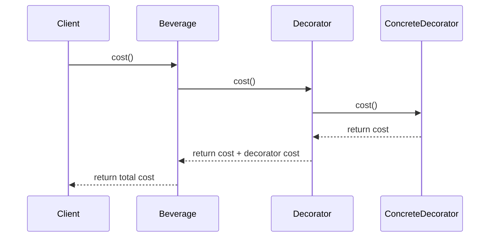
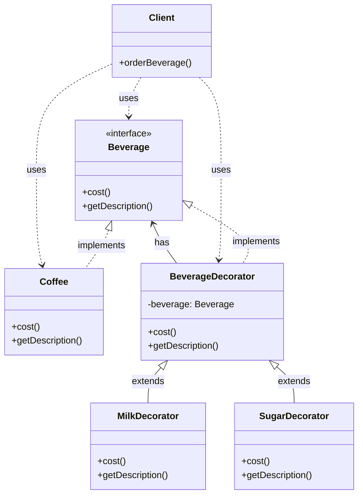

Tôi sẽ giải thích Decorator Pattern với ví dụ về đồ uống, một ví dụ thực tế và dễ hiểu:

###  1. Sequence Diagram - Luồng hoạt động



In the diagram above:

- Solid arrows (->>) represent method calls
- Dashed arrows (-->>) represent return values
- The interaction flow is read from top to bottom
- Shows how decorators wrap and enhance the base beverage

###  2. Class Diagram - Cấu trúc chi tiết



In the diagram above:

- Solid arrows with triangles (--|>) represent inheritance (implements)
- Solid arrows with lines (--|>) represent inheritance (extends)
- Dashed arrows (..>) represent usage relationships (uses)
- Components marked with <<interface>> are interfaces
- Other components are classes

Example code to illustrate:

```java
// Interface for beverages
interface Beverage {
    double cost();
    String getDescription();
}

// Basic coffee class
class Coffee implements Beverage {
    @Override
    public double cost() {
        return 1.00;
    }
    
    @Override
    public String getDescription() {
        return "Coffee";
    }
}

// Abstract decorator class
abstract class BeverageDecorator implements Beverage {
    protected Beverage beverage;
    
    public BeverageDecorator(Beverage beverage) {
        this.beverage = beverage;
    }
    
    @Override
    public String getDescription() {
        return beverage.getDescription();
    }
}

// Concrete decorator for milk
class MilkDecorator extends BeverageDecorator {
    public MilkDecorator(Beverage beverage) {
        super(beverage);
    }
    
    @Override
    public double cost() {
        return beverage.cost() + 0.50;
    }
    
    @Override
    public String getDescription() {
        return beverage.getDescription() + ", Milk";
    }
}

// Concrete decorator for sugar
class SugarDecorator extends BeverageDecorator {
    public SugarDecorator(Beverage beverage) {
        super(beverage);
    }
    
    @Override
    public double cost() {
        return beverage.cost() + 0.25;
    }
    
    @Override
    public String getDescription() {
        return beverage.getDescription() + ", Sugar";
    }
}

// Client class
class Client {
    public static void main(String[] args) {
        // Create a coffee
        Beverage coffee = new Coffee();
        
        // Add milk decorator
        coffee = new MilkDecorator(coffee);
        
        // Add sugar decorator
        coffee = new SugarDecorator(coffee);
        
        // Print the final cost and description
        System.out.println(coffee.getDescription() + " $" + coffee.cost());
    }
}
```

Decorator Pattern allows you to dynamically add additional responsibilities to an object. It provides a flexible alternative to subclassing for extending functionality.