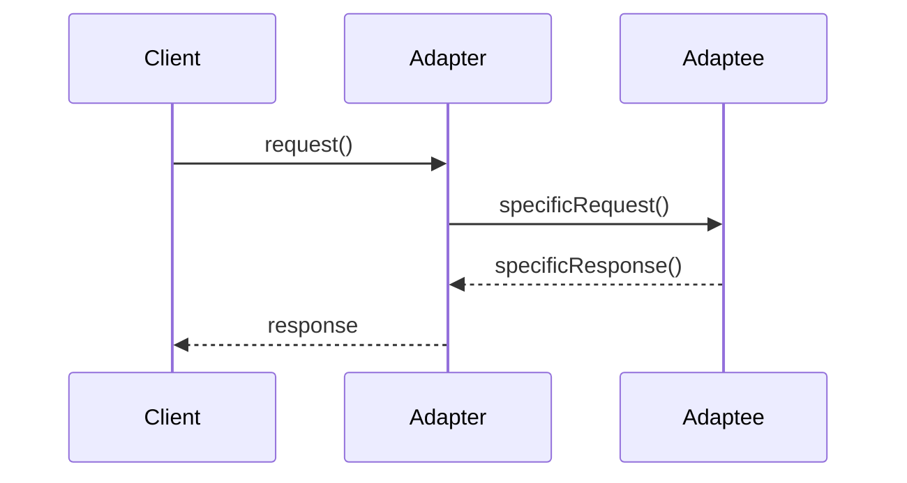
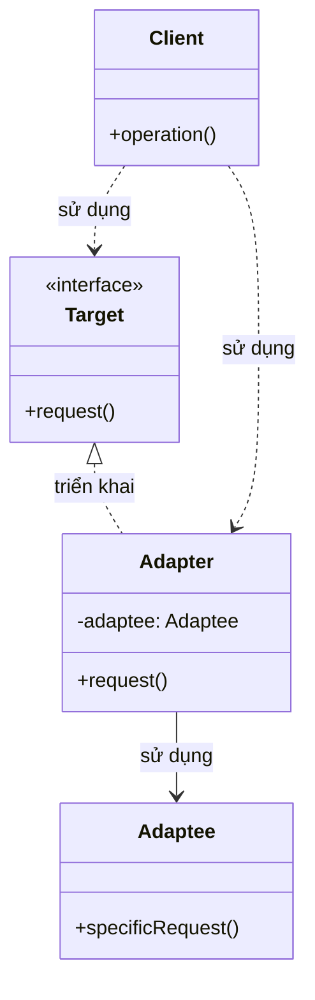

Tôi sẽ giải thích Adapter Pattern với cả sequence diagram và class diagram để bạn dễ hiểu hơn:

###  1. Sequence Diagram - Luồng hoạt động



Trong sơ đồ trên:

- Mũi tên liền nét (->>) thể hiện việc gọi phương thức
- Mũi tên đứt nét (-->>) thể hiện việc trả về kết quả
- Luồng tương tác được đọc từ trên xuống dưới
- Thể hiện cách Adapter chuyển đổi yêu cầu từ Client sang định dạng mà Adaptee có thể xử lý

###  2. Class Diagram - Cấu trúc chi tiết



Trong sơ đồ trên:

- Mũi tên liền nét với tam giác (-->|>) thể hiện quan hệ kế thừa (implements)
- Mũi tên đứt nét (..>) thể hiện quan hệ sử dụng (uses)
- Các thành phần được đánh dấu <<interface>> là interface
- Các thành phần khác là class

Ví dụ code để minh họa:

```java
public interface Target {
    void request();
}

public class Adaptee {
    public void specificRequest() {
        System.out.println("Adaptee: Handling specific request.");
    }
}

public class Adapter implements Target {
    private Adaptee adaptee;
    
    public Adapter(Adaptee adaptee) {
        this.adaptee = adaptee;
    }
    
    @Override
    public void request() {
        System.out.println("Adapter: Converting interface...");
        adaptee.specificRequest();
        System.out.println("Adapter: Interface converted.");
    }
}

public class Client {
    public static void main(String[] args) {
        Adaptee adaptee = new Adaptee();
        Target target = new Adapter(adaptee);
        target.request();
    }
}
```

Adapter Pattern cho phép các interface không tương thích có thể làm việc với nhau thông qua một lớp trung gian (Adapter). Pattern này giúp bạn có thể sử dụng các class có interface khác nhau mà không cần thay đổi code của chúng.