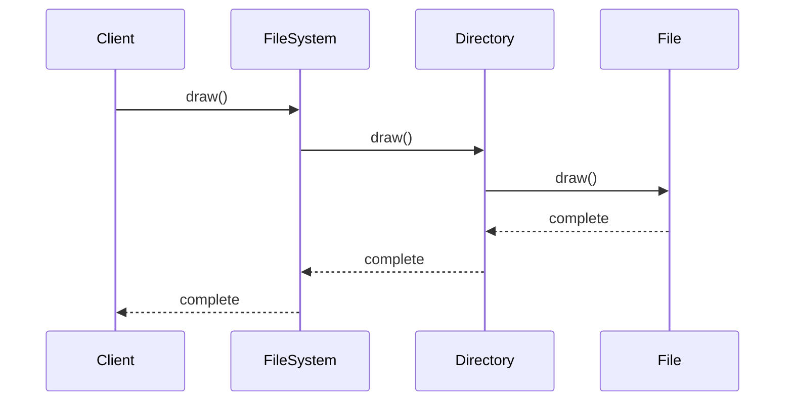
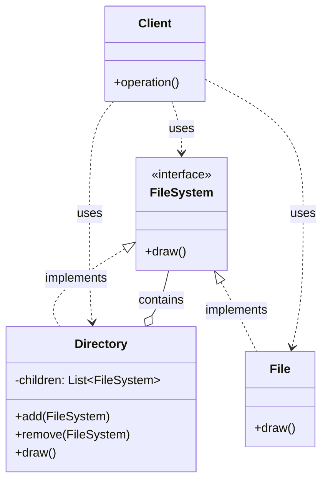

Tôi sẽ giải thích Composite Pattern với ví dụ về hệ thống file và thư mục, một ví dụ thực tế và dễ hiểu hơn:

###  1. Sequence Diagram - Luồng hoạt động



In the diagram above:

- Solid arrows (->>) represent method calls
- Dashed arrows (-->>) represent return values
- The interaction flow is read from top to bottom
- Shows how Client interacts with both composite (Directory) and leaf (File) components

###  2. Class Diagram - Cấu trúc chi tiết



In the diagram above:

- Solid arrows with triangles (--|>) represent inheritance (implements)
- Dashed arrows (..>) represent usage relationships (uses)
- Diamond arrow (o--) represents composition (contains)
- Components marked with <<interface>> are interfaces
- Other components are classes

Example code to illustrate:

```java
// Interface for file system components
interface FileSystem {
    void draw();
}

// Composite class representing a directory
class Directory implements FileSystem {
    private List<FileSystem> children = new ArrayList<>();
    
    @Override
    public void draw() {
        System.out.println("Drawing directory");
        for (FileSystem child : children) {
            child.draw();
        }
    }
    
    public void add(FileSystem component) {
        children.add(component);
    }
    
    public void remove(FileSystem component) {
        children.remove(component);
    }
}

// Leaf class representing a file
class File implements FileSystem {
    private String name;
    
    public File(String name) {
        this.name = name;
    }
    
    @Override
    public void draw() {
        System.out.println("Drawing file: " + name);
    }
}

// Client class
class Client {
    public static void main(String[] args) {
        // Create a directory
        FileSystem root = new Directory();
        
        // Add files and subdirectories
        root.add(new File("document.txt"));
        root.add(new File("image.jpg"));
        
        // Create a subdirectory
        FileSystem docs = new Directory();
        docs.add(new File("report.pdf"));
        root.add(docs);
        
        // Draw the entire file system
        root.draw();
    }
}
```

Composite Pattern allows you to compose objects into tree structures to represent part-whole hierarchies. It lets clients treat individual objects (files) and compositions of objects (directories) uniformly.