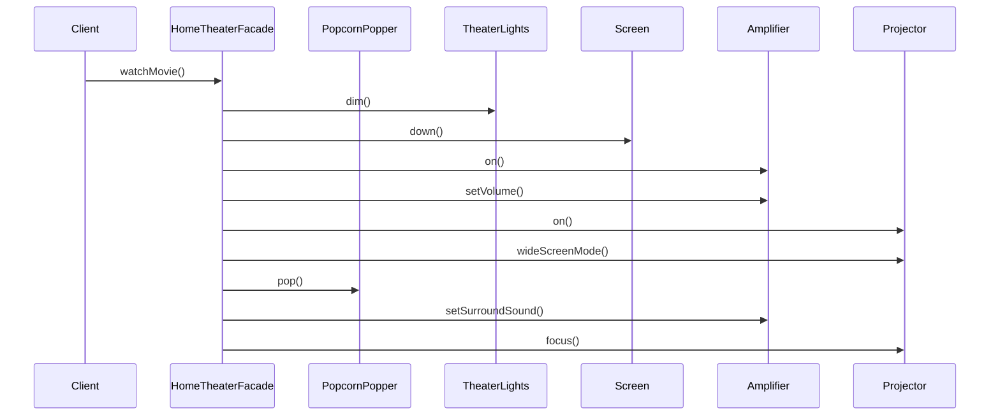
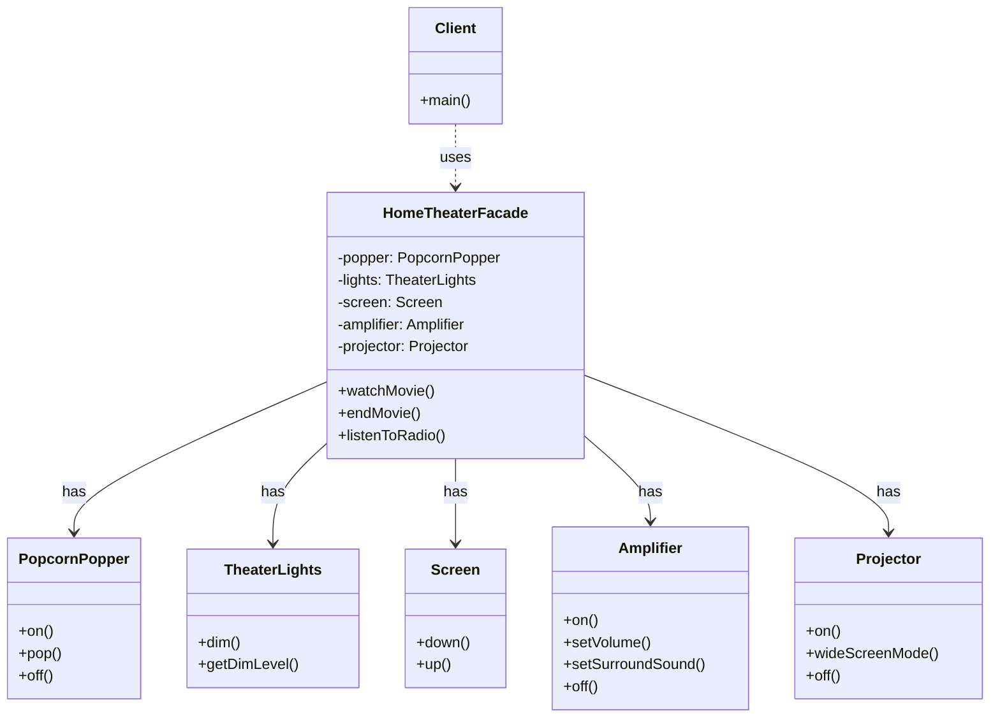

Tôi sẽ giải thích Facade Pattern với ví dụ về hệ thống giải trí gia đình, một ví dụ thực tế và dễ hiểu:

###  1. Sequence Diagram - Luồng hoạt động



In the diagram above:

- Solid arrows (->>) represent method calls
- The interaction flow is read from top to bottom
- Shows how Facade coordinates multiple subsystems
- Each subsystem performs its specific task

###  2. Class Diagram - Cấu trúc chi tiết



In the diagram above:

- Dashed arrows (..>) represent usage relationships (uses)
- Solid arrows with lines (-->) represent composition (has)
- Each subsystem is a separate class with its own responsibilities
- Facade class coordinates all subsystems

Example code to illustrate:

```java
// Subsystem classes
class PopcornPopper {
    public void on() {
        System.out.println("Popcorn Popper: On");
    }
    
    public void pop() {
        System.out.println("Popcorn Popper: Poping popcorn!");
    }
    
    public void off() {
        System.out.println("Popcorn Popper: Off");
    }
}

class TheaterLights {
    private int dimLevel;
    
    public void dim(int level) {
        dimLevel = level;
        System.out.println("Theater Lights: Dimming to " + dimLevel + "%");
    }
    
    public int getDimLevel() {
        return dimLevel;
    }
}

class Screen {
    public void down() {
        System.out.println("Screen: Going down");
    }
    
    public void up() {
        System.out.println("Screen: Going up");
    }
}

class Amplifier {
    private int volume;
    private boolean on;
    
    public void on() {
        on = true;
        System.out.println("Amplifier: On");
    }
    
    public void setVolume(int volume) {
        this.volume = volume;
        System.out.println("Amplifier: Setting volume to " + volume + "%");
    }
    
    public void setSurroundSound() {
        System.out.println("Amplifier: Surround sound on");
    }
    
    public void off() {
        on = false;
        System.out.println("Amplifier: Off");
    }
}

class Projector {
    public void on() {
        System.out.println("Projector: On");
    }
    
    public void wideScreenMode() {
        System.out.println("Projector: Setting wide screen mode");
    }
    
    public void off() {
        System.out.println("Projector: Off");
    }
}

// Facade class
class HomeTheaterFacade {
    private PopcornPopper popper;
    private TheaterLights lights;
    private Screen screen;
    private Amplifier amplifier;
    private Projector projector;
    
    public HomeTheaterFacade(PopcornPopper popper, TheaterLights lights,
                            Screen screen, Amplifier amplifier,
                            Projector projector) {
        this.popper = popper;
        this.lights = lights;
        this.screen = screen;
        this.amplifier = amplifier;
        this.projector = projector;
    }
    
    public void watchMovie() {
        System.out.println("Getting ready to watch a movie...");
        popper.on();
        popper.pop();
        lights.dim(10);
        screen.down();
        projector.on();
        projector.wideScreenMode();
        amplifier.on();
        amplifier.setSurroundSound();
        amplifier.setVolume(5);
    }
    
    public void endMovie() {
        System.out.println("Shutting movie theater down...");
        popper.off();
        lights.dim(0);
        screen.up();
        projector.off();
        amplifier.off();
    }
    
    public void listenToRadio() {
        System.out.println("Tuning in the radio...");
        amplifier.on();
        amplifier.setVolume(5);
        amplifier.setSurroundSound();
    }
}

// Client class
class Client {
    public static void main(String[] args) {
        // Create subsystems
        PopcornPopper popper = new PopcornPopper();
        TheaterLights lights = new TheaterLights();
        Screen screen = new Screen();
        Amplifier amplifier = new Amplifier();
        Projector projector = new Projector();
        
        // Create facade
        HomeTheaterFacade homeTheater = new HomeTheaterFacade(
            popper, lights, screen, amplifier, projector);
        
        // Use facade
        homeTheater.watchMovie();
        homeTheater.endMovie();
    }
}
```

Facade Pattern provides a unified interface to a set of interfaces in a subsystem. It defines a higher-level interface that makes the subsystem easier to use.