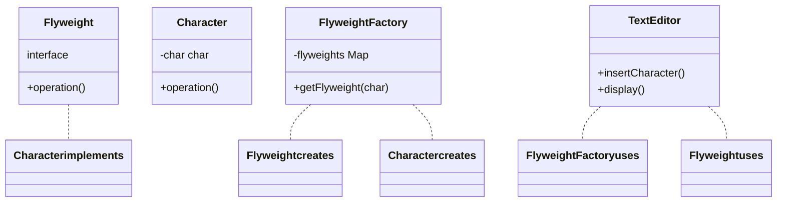

Tôi sẽ giải thích Flyweight Pattern với ví dụ về hệ thống quản lý văn bản, một ví dụ thực tế và dễ hiểu

###  1. Sequence Diagram - Luồng hoạt động

```mermaid
sequenceDiagram
    participant Client as Client
    participant Factory as FlyweightFactory
    participant Flyweight as Flyweight
    participant Shared as SharedState
    
    Client-Factory getFlyweight(state)
    Factory-Factory Check cache
    Factory-Flyweight Create new
    Flyweight-Shared Store state
    Flyweight--Factory Return instance
    Factory--Client Return flyweight
    
    Note over Client,Shared Multiple clients share same flyweight
    
    Client-Flyweight operation()
    Flyweight-Shared Use shared state
    Shared--Flyweight Return data
    Flyweight--Client Return result
```

In the diagram above

- Solid arrows (-) represent method calls
- Dashed arrows (--) represent return values
- The interaction flow is read from top to bottom
- Shows how multiple clients share the same flyweight instance

###  2. Class Diagram - Cấu trúc chi tiết



In the diagram above

- Solid arrows with triangles (--) represent inheritance (implements)
- Dashed arrows (..) represent usage relationships (usescreates)
- Components marked with interface are interfaces
- Other components are classes

Example code to illustrate

```java
 Interface for flyweight
interface Flyweight {
    void operation();
}

 Concrete flyweight class
class Character implements Flyweight {
    private char symbol;
    
    public Character(char symbol) {
        this.symbol = symbol;
    }
    
    @Override
    public void operation() {
        System.out.println(Displaying character  + symbol);
    }
}

 Flyweight factory class
class FlyweightFactory {
    private static MapCharacter, Flyweight flyweights = new HashMap();
    
    public static Flyweight getFlyweight(char key) {
        Flyweight flyweight = flyweights.get(key);
        if (flyweight == null) {
            flyweight = new Character(key);
            flyweights.put(key, flyweight);
        }
        return flyweight;
    }
}

 Client class
class TextEditor {
    private ListFlyweight characters = new ArrayList();
    
    public void insertCharacter(char c) {
        Flyweight flyweight = FlyweightFactory.getFlyweight(c);
        characters.add(flyweight);
    }
    
    public void display() {
        for (Flyweight charFlyweight  characters) {
            charFlyweight.operation();
        }
    }
}

 Usage example
public class Client {
    public static void main(String[] args) {
        TextEditor editor = new TextEditor();
        
         Insert multiple 'a' characters
        editor.insertCharacter('a');
        editor.insertCharacter('a');
        editor.insertCharacter('b');
        
         Display all characters
        editor.display();
    }
}
```

Flyweight Pattern provides a way to minimize memory usage by sharing common data between multiple objects. It's particularly useful when dealing with large numbers of objects that contain duplicate state.