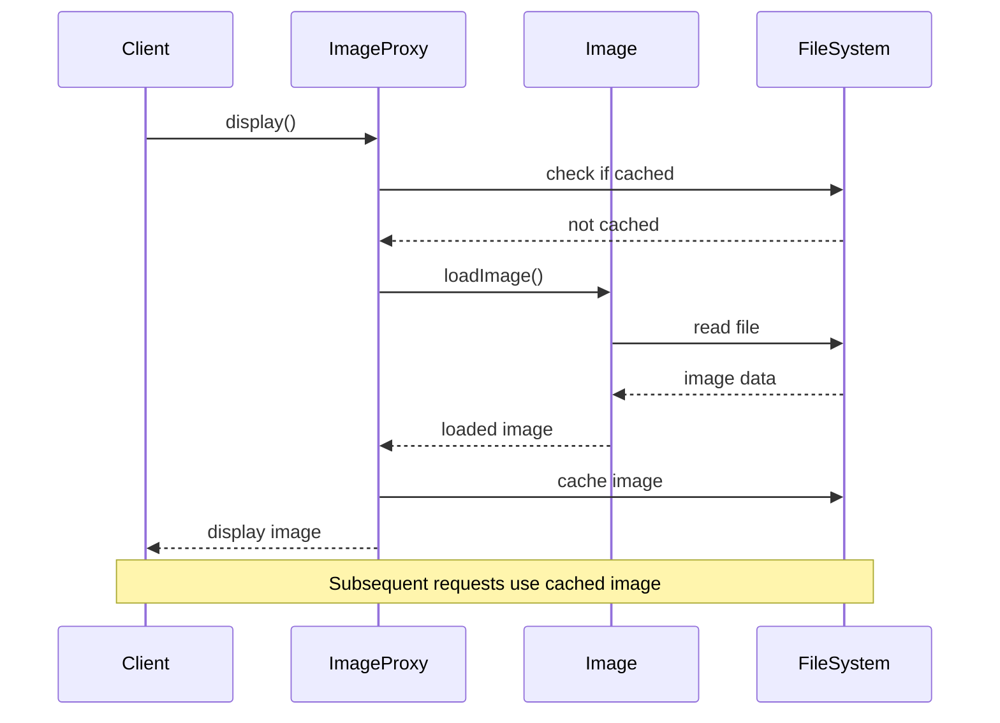
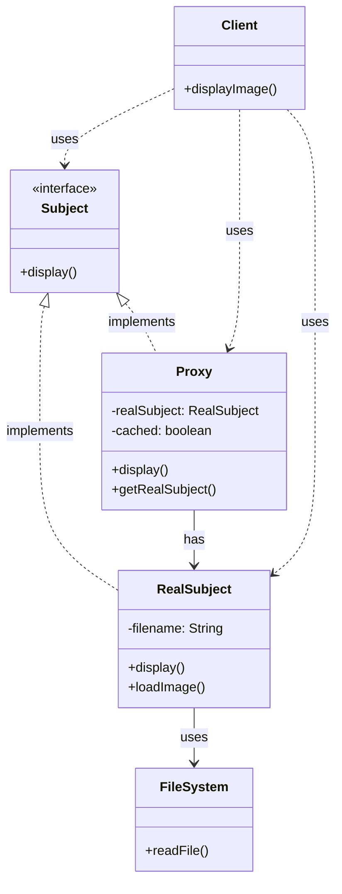

Tôi sẽ giải thích Proxy Pattern với ví dụ về hệ thống tải hình ảnh, một ví dụ thực tế và dễ hiểu:

###  1. Sequence Diagram - Luồng hoạt động



In the diagram above:

- Solid arrows (->>) represent method calls
- Dashed arrows (-->>) represent return values
- The interaction flow is read from top to bottom
- Shows how Proxy handles caching and delegates to RealSubject

###  2. Class Diagram - Cấu trúc chi tiết



In the diagram above:

- Solid arrows with triangles (--|>) represent inheritance (implements)
- Dashed arrows (..>) represent usage relationships (uses)
- Diamond arrow (-->) represents composition (has)
- Components marked with <<interface>> are interfaces
- Other components are classes

Example code to illustrate:

```java
// Interface for subjects
interface Subject {
    void display();
}

// Real subject class
class RealImage implements Subject {
    private String fileName;
    
    public RealImage(String fileName) {
        this.fileName = fileName;
        loadImage();
    }
    
    private void loadImage() {
        System.out.println("Loading " + fileName);
        // Simulate loading time
        try {
            Thread.sleep(3000);
        } catch (InterruptedException e) {
            e.printStackTrace();
        }
    }
    
    @Override
    public void display() {
        System.out.println("Displaying " + fileName);
    }
}

// Proxy class
class ImageProxy implements Subject {
    private RealImage realImage;
    private String fileName;
    private boolean loaded = false;
    
    public ImageProxy(String fileName) {
        this.fileName = fileName;
    }
    
    @Override
    public void display() {
        if (!loaded) {
            realImage = new RealImage(fileName);
            loaded = true;
        }
        realImage.display();
    }
    
    public RealImage getRealImage() {
        if (!loaded) {
            realImage = new RealImage(fileName);
            loaded = true;
        }
        return realImage;
    }
}

// Client class
class Client {
    public static void main(String[] args) {
        // Create proxy images
        Subject image1 = new ImageProxy("image1.jpg");
        Subject image2 = new ImageProxy("image1.jpg");
        
        // Display images
        image1.display(); // Loads and displays
        image2.display(); // Uses cached image
    }
}
```

Proxy Pattern provides a surrogate or placeholder for another object to control access to it. It's useful for optimizing resource usage, adding functionality, or controlling access to expensive objects.