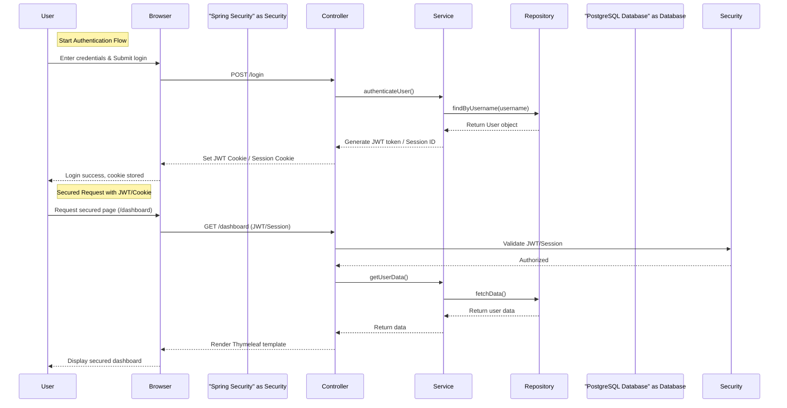

Dưới đây là ví dụ về cách xây dựng UML Sequence Diagram thể hiện luồng xử lý từ client đến database, step-by-step, của một ứng dụng web cơ bản sử dụng:

- **Spring Boot**
- **Spring Data JPA**
- **Spring Security (JWT hoặc Cookie + Session)**
- **Hibernate**
- **PostgreSQL**
- **MVC Pattern**
- **Thymeleaf**
- **Layered Architecture**

Dưới đây là code của Sequence Diagram bằng PlantUML (một công cụ phổ biến để tạo diagram bằng code):

### 📝 **Sequence Diagram (PlantUML)**

### Giải thích các thành phần chính:

1. **Người dùng (User)**: tương tác với trình duyệt để gửi yêu cầu.
2. **Browser**: gửi request HTTP đến server, chứa cookie/session.
3. **Controller (MVC)**
   - Tiếp nhận request và định tuyến đến phương thức phù hợp.
   - Gọi các phương thức trong Service Layer.
   - Đảm nhận xử lý dữ liệu (mapping data, validate request).

2. **Service Layer**
   - Xử lý logic nghiệp vụ.
   - Gọi Repository để lấy dữ liệu.
   - Thực hiện Authentication, tạo JWT hoặc quản lý Session.

3. **Repository Layer (Spring Data JPA/Hibernate)**
   - Giao tiếp trực tiếp với CSDL.
   - Truy vấn hoặc cập nhật dữ liệu.

4. **Database (PostgreSQL)**
   - Lưu trữ dữ liệu.

4. **Thymeleaf (View)**
   - Nhận dữ liệu từ Controller.
   - Hiển thị dữ liệu trên trình duyệt cho người dùng.

5. **Spring Security**
   - Kiểm tra thông tin đăng nhập.
   - Tạo và trả về JWT hoặc Session cookie.
   - Xử lý các yêu cầu xác thực tiếp theo.

---

### Một số lưu ý khi triển khai thực tế:

- JWT thường được trả về trong response body hoặc lưu trữ trong Cookie. Session sử dụng Cookie hoặc bộ nhớ DB/Redis để lưu trạng thái.
- Luồng thực hiện trên có thể thay đổi linh hoạt tùy theo yêu cầu thực tế, nhưng đảm bảo luôn tuân thủ kiến trúc MVC và Layered Architecture.
- Bạn có thể sử dụng các công cụ như [PlantUML](https://plantuml.com/) hoặc [draw.io](https://app.diagrams.net/) để vẽ và trực quan hóa dễ dàng hơn.

---

Bạn có thể sao chép code trên vào các công cụ hỗ trợ PlantUML để thấy được trực quan Sequence Diagram tương tác rõ ràng và dễ hiểu hơn.